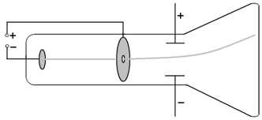

原子物理学

# 原子模型
## 电子和Thomson的阴极射线
低压气体放电管，阴极射线管(CRT)，也叫博朗管(Braun tube)

光束本身实际上是看不见的，但是通过在电子管中加入少量惰性气体(氖、氩等)就可以看到。
阴极射线的荷质比（是氢离子的1000倍），跟管内气体无关，跟阴极材料无关（琐碎的实验需要极好的耐心）
Thomson 又通过 Wilson 云室，测出阴极射线所带的电荷量与氢离子相同，因此称之为电子（electron）
电子在其平衡位置的震动构成了原子的光谱
阴极射线的表现是粒子的特性，但其作为X 射线也能表现出波的特性

## 原子核和Rutherford 的alpha 粒子散射实验（scattering experiment）
alpha 粒子就是氦核
以原子（金箔）为遮挡物，以如光子、电子、质子、alpha粒子作为探针，做碰撞实验，统计出射角分布
多次散射的角度服从高斯分布（正态分布）

### 定量计算：Rutherford 散射公式
计算微分散射截面（differential cross section），即探针粒子被散射到单位立体角内的概率
截面的单位是barn(b)，1b=10^-24 平方厘米
原子的尺度是10^-10米，原子核的尺度1~10fm 也就是10^-14 米，那么单位的散射截面就是原子核的半径的平方
不过计算小角度偏转不适用，因为相当于直接穿过，受原子核电场影响很小

#### Rutherford 背散射技术
该公式是认为原子核静止不动的，但实际上原子核有反冲，而且不同质量的原子核，会有不同的反冲动能。从而可以通过测量散射alpha粒子的动能检测材料构成元素以及元素的丰度、厚度等信息

#### 深度非弹性散射
如果靶内有点状结构，就会出现大角度散射
用高能电子轰击质子，存在电子的大角度散射，表明质子内部有一个半径很小的散射中心（夸克模型的重要证据之一）

#### 行星模型与原子坍缩佯谬
加速运动的带电粒子，必然要向外辐射电磁波
而行星模型的电子有向心加速度，就必然要辐射电磁波，就会衰减能量，最终落入原子核，所需时间只有10^-10s

## Bohr 的氢原子理论
### 原子光谱
原子吸收和发射的光的强度随波长变化，呈分立的谱线结构
每种元素都有自己的独特光谱，是元素的指纹
Balmer 公式总结出氢原子光谱波长的倒数（跟波的频率相关）呈现规律性

光子能量 > 12.5eV 的电磁辐射会被氮气吸收
光子能量 6.8eV~12.5eV 电磁辐射会被氧气、二氧化碳、水分子所吸收
光子能量 4eV~6.8eV 电磁辐射（紫外线）会被臭氧吸收（实际上，臭氧也吸收3~4eV 的紫外线，但吸收截面很低

### 电子轨道
轨道量子化
稳定态：电子只能处于一些分立的稳定轨道（orbital），处于稳定状态的电子不通常不产生辐射
激发态：电子从一个稳定态到另一个稳定态会放出或吸收能量（电磁波），叫做跃迁（transition）

角动量量子化
轨道的角动量（angular momentum）只能取不连续的分立值
如果按照圆周运动模型（向心力=库仑力）可以推导出其速度和轨道半径也是量子化的，而且速度仅仅由量子数决定，进而也可以得到电子的能量也是量子化的
为了便于计算，定义
+ 波尔半径：量子数为1 的电子轨道半径，约为0.53埃
+ 精细结构常数：量子数为1 电子速度和光速之比，约为1/137
+ 里德伯：量子数为1 电子能量（动能+势能），约为13.6eV

### 能级跃迁
退激发：发射光谱
激发：吸收光谱（光子能量必须恰好是两个能级差才能吸收，当然，如果超过一定的能量后也可以把电子打到无限远，也就是发生了光电效应，这个能量就是电离能ionization）

原子的低能级是分立的，而高到一定程度之后就是连续的，所以原子的光谱也会有分立和连续两段光谱

#### 玻尔兹曼分布
玻尔兹曼分布（不应与麦克斯韦-玻尔兹曼分布 Maxwell–Boltzmann distribution混淆）是一个概率分布，它给出了处于某种量子态处于某种能量和温度的时候的概率
所有量子态的概率之和为1，玻尔兹曼分布是使熵最大化的分布，也就是稳态分布，通过计算电子基态和第一能级状态的能量差可以算出处于第一能级状态的原子和基态原子的概率之比是e^-40，差距非常之大，所以可以认为通常状态下原子都处于基态

#### 波尔对应原理
通过计算可以得到氢原子从n=351 跃迁到n=350 辐射的电磁波频率和电子绕核运动的旋转频率一致
对应原理指出，在大量子数情况下，量子规律会过渡到经典规律（量子的统计结果和经典辐射理论之间得到一种联系）
在涉及很多量子的经典极限中，量子力学的定律作为平均结果应导致经典方程
在可以把普朗克常数h看成零的情况下，量子力学则会归结为经典力学

## 类氢原子
比如He+、Li2+、Be3+等，两体有心问题，都可以使用波尔的理论进行解释

在圆周运动模型中都假设原子核不动，电子绕核做圆周运动，但实际上原子核质量不可能是无限大的，因此两体问题是他们共同绕质心做圆周运动
所以在计算里德伯常数时，原子核质量越大，其里德伯常数就越接近于理论值

### Rydberg原子
里德伯原子是由Z-1个近轨电子和原子核（原子实，可以近似为一个带1个正点的点粒子）与 1个远核的电子组成的原子。这种原子也可以使用波尔理论进行解释
比如最外面的电子处于很高的激发态的Li 原子
由于里德伯原子最外的激发态电子对应的量子数n 很大，所以
其原子尺度很大，可以达到微米级
其电离能很小，很容易受干扰，只能存在于高真空中
其能级间隔很小，所以需要很高分辨率的光谱技术才能分辨其光谱
其寿命远长于一般原子的激发态
很容易收到原子外部场的作用

### 奇特原子
将近轨电子使用其他负电荷粒子取代，由于其质量很重，因此离核很近，从而和原子核组成了一个特殊的原子实，这个原子实和原来的远核电子组成的就是一种特殊原子。他们也可以使用波尔理论进行解释。
例如He 的一个电子被μ-取代，其化学性质就很类似于氢
奇特原子的特点：
半径很小，原子核磁矩和电四极矩、负电粒子的自旋-轨道相互作用都会凸显起来

### 反氢原子
由反质子和正电子组成的

## 电子偶素
由正负电子、μ+和电子、π+和电子组成的二体系统