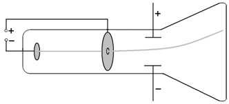

原子物理学-朱林繁、彭新华 编
中国科学技术大学出版社

# 原子模型
## 电子和Thomson的阴极射线
低压气体放电管，阴极射线管(CRT)，也叫博朗管(Braun tube)

光束本身实际上是看不见的，但是通过在电子管中加入少量惰性气体(氖、氩等)就可以看到。
阴极射线的荷质比（是氢离子的1000倍），跟管内气体无关，跟阴极材料无关（琐碎的实验需要极好的耐心）
Thomson 又通过 Wilson 云室，测出阴极射线所带的电荷量与氢离子相同，因此称之为电子（electron）
电子在其平衡位置的震动构成了原子的光谱
阴极射线的表现是粒子的特性，但其作为X 射线也能表现出波的特性

## 原子核和Rutherford 的alpha 粒子散射实验（scattering experiment）
alpha 粒子就是氦核
以原子（金箔）为遮挡物，以如光子、电子、质子、alpha粒子作为探针，做碰撞实验，统计出射角分布
多次散射的角度服从高斯分布（正态分布）

### 定量计算：Rutherford 散射公式
计算微分散射截面（differential cross section），即探针粒子被散射到单位立体角内的概率
截面的单位是barn(b)，1b=10^-24 平方厘米
原子的尺度是10^-10米，原子核的尺度1~10fm 也就是10^-14 米，那么单位的散射截面就是原子核的半径的平方
不过计算小角度偏转不适用，因为相当于直接穿过，受原子核电场影响很小

#### Rutherford 背散射技术
该公式是认为原子核静止不动的，但实际上原子核有反冲，而且不同质量的原子核，会有不同的反冲动能。从而可以通过测量散射alpha粒子的动能检测材料构成元素以及元素的丰度、厚度等信息

#### 深度非弹性散射
如果靶内有点状结构，就会出现大角度散射
用高能电子轰击质子，存在电子的大角度散射，表明质子内部有一个半径很小的散射中心（夸克模型的重要证据之一）

#### 行星模型与原子坍缩佯谬
加速运动的带电粒子，必然要向外辐射电磁波
而行星模型的电子有向心加速度，就必然要辐射电磁波，就会衰减能量，最终落入原子核，所需时间只有10^-10s

## Bohr 的氢原子理论
### 原子光谱
原子吸收和发射的光的强度随波长变化，呈分立的谱线结构
每种元素都有自己的独特光谱，是元素的指纹
Balmer 公式总结出氢原子光谱波长的倒数（跟波的频率相关）呈现规律性

光子能量 > 12.5eV 的电磁辐射会被氮气吸收
光子能量 6.8eV~12.5eV 电磁辐射会被氧气、二氧化碳、水分子所吸收
光子能量 4eV~6.8eV 电磁辐射（紫外线）会被臭氧吸收（实际上，臭氧也吸收3~4eV 的紫外线，但吸收截面很低

### 电子轨道
轨道量子化
稳定态：电子只能处于一些分立的稳定轨道（orbital），处于稳定状态的电子不通常不产生辐射
激发态：电子从一个稳定态到另一个稳定态会放出或吸收能量（电磁波），叫做跃迁（transition）

角动量量子化
轨道的角动量（angular momentum）只能取不连续的分立值
如果按照圆周运动模型（向心力=库仑力）可以推导出其速度和轨道半径也是量子化的，而且速度仅仅由量子数决定，进而也可以得到电子的能量也是量子化的
为了便于计算，定义
+ 波尔半径：量子数为1 的电子轨道半径，约为0.53埃
+ 精细结构常数：量子数为1 电子速度和光速之比，约为1/137
+ 里德伯：量子数为1 电子能量（动能+势能），约为13.6eV

### 能级跃迁
退激发：发射光谱
激发：吸收光谱（光子能量必须恰好是两个能级差才能吸收，当然，如果超过一定的能量后也可以把电子打到无限远，也就是发生了光电效应，这个能量就是电离能ionization）

原子的低能级是分立的，而高到一定程度之后就是连续的，所以原子的光谱也会有分立和连续两段光谱

#### 玻尔兹曼分布
玻尔兹曼分布（不应与麦克斯韦-玻尔兹曼分布 Maxwell–Boltzmann distribution混淆）是一个概率分布，它给出了处于某种量子态处于某种能量和温度的时候的概率
所有量子态的概率之和为1，玻尔兹曼分布是使熵最大化的分布，也就是稳态分布，通过计算电子基态和第一能级状态的能量差可以算出处于第一能级状态的原子和基态原子的概率之比是e^-40，差距非常之大，所以可以认为通常状态下原子都处于基态

#### 波尔对应原理
通过计算可以得到氢原子从n=351 跃迁到n=350 辐射的电磁波频率和电子绕核运动的旋转频率一致
对应原理指出，在大量子数情况下，量子规律会过渡到经典规律（量子的统计结果和经典辐射理论之间得到一种联系）
在涉及很多量子的经典极限中，量子力学的定律作为平均结果应导致经典方程
在可以把普朗克常数h看成零的情况下，量子力学则会归结为经典力学

## 类氢原子
比如He+、Li2+、Be3+等，两体有心问题，都可以使用波尔的理论进行解释

在圆周运动模型中都假设原子核不动，电子绕核做圆周运动，但实际上原子核质量不可能是无限大的，因此两体问题是他们共同绕质心做圆周运动
所以在计算里德伯常数时，原子核质量越大，其里德伯常数就越接近于理论值

### Rydberg原子
里德伯原子是由Z-1个近轨电子和原子核（原子实，可以近似为一个带1个正点的点粒子）与 1个远核的电子组成的原子。这种原子也可以使用波尔理论进行解释
比如最外面的电子处于很高的激发态的Li 原子
由于里德伯原子最外的激发态电子对应的量子数n 很大，所以
其原子尺度很大，可以达到微米级
其电离能很小，很容易受干扰，只能存在于高真空中
其能级间隔很小，所以需要很高分辨率的光谱技术才能分辨其光谱
其寿命远长于一般原子的激发态
很容易收到原子外部场的作用

### 奇特原子
将近轨电子使用其他负电荷粒子取代，由于其质量很重，因此离核很近，从而和原子核组成了一个特殊的原子实，这个原子实和原来的远核电子组成的就是一种特殊原子。他们也可以使用波尔理论进行解释。
例如He 的一个电子被μ-取代，其化学性质就很类似于氢
奇特原子的特点：
半径很小，原子核磁矩和电四极矩、负电粒子的自旋-轨道相互作用都会凸显起来

### 反氢原子
由反质子和正电子组成的

### 电子偶素
由正负电子、μ+和电子、π+和电子组成的二体系统

## 电子碰撞谱学
弗兰克-赫兹实验通过连续调整电压对电子进行加速，在向阳极的运动过程中碰撞汞蒸气原子，在阳极测的的电流量呈现波动性，是由于电子可以在碰撞汞原子时，如果刚好达到汞的激发能级差，就会发生非弹性碰撞，损失动能，激发汞原子，就会减少到达阳极的电子量；随着电压继续升高，电子可能会被多次加速，然后有可能发生多次的非弹性碰撞。因此电流量呈现波动性。

# 量子力学
## 波粒二象性
波的现象，如干涉、衍射、偏振、相干叠加性，光都具备，但它又与机械波的震动完全不同
粒子的现象，如离散值、碰撞效应
光具有波动和粒子的双重属性。波粒二象性是同一物质在不同场合下展现出来的不同现象。即在空间传播具有波动性，而在相互作用中具有粒子性。波动性和粒子性通过普朗克常量联系起来。

### 黑体辐射
任何有温度的物体都会向外辐射电磁波，即热辐射。热辐射有两个关键指标：
单色辐射本领：在温度T下，单位面积上单位波长范围内的辐射功率
单色吸收系数：在温度T下，单位面积上吸收单位波长范围内的功率占相应辐射场功率的比率（即辐射到物体表面上的光能被吸收的比例，显然<=1，因为还有反射和透射部分，而=1的物质就叫做黑体）
基尔霍夫定律，物体的单色辐射本领和单色吸收系数的比值，与物体的具体性质无关，对所有物体而言，是一个普适的关于波长和温度的函数
这个普适规律 ，反应了物质内最基本的运动规律

对于黑体辐射而言，这个普适函数，可以通过测量黑体的单色辐射本领的函数图像
该图像随温度单调增加，而且增速增加的很快；而随波长增加，则存在一个极值，并且该极大值随着温度增加而向短波方向移动
维恩利用热力学原理，得出黑体的单色辐射本领公式，而且确定温度和极值对应的波长值的乘积是一个常量（维恩位移定律），该公式在短波区和实验数据吻合的很好，但在长波区普遍偏低
瑞利-金斯假设黑体空腔中的电磁波是驻波，而每一个驻波模式相应与一个自由度，再结合能量均分定律，推导出瑞利-金斯公式，该公式在长波区和实验数据吻合的很好，但当波长趋近与0时，公式趋近无穷大，跟实验趋近于0，相差甚远。这一公式是根据经典电磁理论和经典统计物理严格推导出的。这种经典理论和实验结果在短波区的严重分歧称为“紫外灾难”
普朗克首先根据实验数据猜想了一个公式，然后与1900你那12月14日（量子理论诞生日）对该公式进行了解释，黑体空腔中谐振子的能量只能取一系列不连续的离散值，必须是某个最小能量单元的整数倍，而这个最小能量单元和光波频率的比值是一个常量（普朗克常量）
普朗克公式在波长趋近于0时，会退化为维恩公式；在趋近于无穷大时，会退化为瑞利-金斯公式

### 光电效应
紫外线使电子从金属表面逸出，电子的数目和入射光强成正比，电子动能随波长变短而增大，与光强无关
应用：光电倍增管阵列（微通道板，粒子探测器，也是夜视仪的关键部件），光电二极管（自动控制），光电记录器件（数码相机），通过电离能测定材料
爱因斯坦受普朗克量子化启发，提出光量子，在光和物质相互作用的过程中，光能集中在一些光子的粒子上，能量正比于频率。在光电效应过程中，电子的动能 = 光能 - 材料逸出功（材料电离能）
光强决定光子的数量，光压就是光子的动量体现，电子至多只能吸收一个光子，若足以逸出，则立即发射

### Compton效应
将直射的X射线通过散射物质后，测量不同散射角的散射光的波长，发现除了原有波长的X 光外，还产生了比原有波长更大的X 光，并且波长的增量只随散射角的不同而变化（跟入射原波长和散射物质都无关）。
康普顿将X 射线作为具有一定能量hv 和一定动量hv/c 的经典粒子跟散射物质中的电子（被认为为自由且静止）计算弹性碰撞过程中的能量守恒和动量守恒（考虑相对论效应）
康普顿散射理论非常直观的证明了光的粒子性，以及微观碰撞过程中能量守恒和动量守恒依然成立
之所以将电子假设成静止也能和实验吻合，是因为X 射线的能级比靶材料中的电子束缚能高了3个数量级

康普顿轮廓的应用
通过统计分析散射光中的波长分布，可以反推散射材料中电子的动量分布，进而可以分析出散射材料中的物质构成

### 单光子的双缝干涉
即使将单个光子依次先后通过双缝，与大量光子同时通过双缝时的效果完全相同
这说明了光子不是经典理论中的粒子，也就是说即使一个光子也具备波动性

### 德布罗意波
实物粒子也具备波动性，只不过其波长太小，导致我们很难观测到其波动性
这一点是由戴维森-革末和G.P.Thomson 的电子的晶体衍射实验证实
按照光子的动量公式p = hv/c = h/lambda，于是实物粒子的波长lambda = h/p（p 是动量，实物动量中的速度需要考虑相对论效应）
按照光子的能量公式E = hv，于是实物粒子的频率v = E/h

按照公式计算电子的波长为10^-10米（原子级）
戴维森-革末的实验是将准直加速的电子束射到镍单晶的表面测量的散射角和加速电压的关系得到第一个加速电压对应的电子动能的极大值为54eV，此时散射角为50度
而满足衍射极大的条件是光程差d*sin(theta) = n*lambda，n=1 时恰好theta = 50度
G.P.Thomson 的实验是使用高能电子束（10~40keV）直接穿透多晶金属箔，在箔后面的底片上，可以拍到同心圆的衍射花纹

而两者的实验也分别成为低能电子衍射仪和高能电子衍射仪，分别用于分析材料表面结构、物性，和薄膜的结构、物性

德布罗意波，又叫物质波，它并不对应任何三维空间的真实波动
物质的粒子性体现在单个微观粒子所具有的能量不随时间和空间的变化而弥散（动量、能量守恒），其波动性对应是波的相干叠加性，这里的波不是空间上的震动，而是空间上的出现概率

## 薛定谔方程
对于机械波而言，可以用一个三角函数描述它
对于平面电磁波而言，也可以用类似的三角函数描述
那么可以用相似的三角函数描述物质波，参数是振幅、圆频率、波矢（表示波的传播方向）
使用复数形式，并将圆频率、波矢转换为能量和动量的表示，就得到自由粒子的波函数（关于空间位置向量和时间的函数）
将自由粒子的波函数对时间求偏微分可以解出能量E和波函数的关系
对自由粒子的波函数在空间三维计算拉普拉斯算子可以解出动量p和波函数的关系
然后根据E = p^2/2/m + U（U 为势能，若无势场，则U=0），联立上面两个关系，可以解出质量和波函数的关系（自由粒子的薛定谔方程）

薛定谔方程描述了给定质量的物体在势场中的状态（空间位置向量）随时间的变化

与此同时，海森堡提出矩阵力学，薛定谔证明矩阵力学等价于薛定谔方程，不过是不同的数学表达形式

### 波函数的统计解释
1927年，哥本哈根学派的波恩将波函数的模方，代表了指定时刻，在空间位置上，粒子出现的概率密度

该解释给出了波函数的一些特性，即若对全空间的波函数模方进行积分，则=1
这是由于波函数乘以一个常数，也只是影响振幅，而波函数的振幅是在被解释为概率幅之前是没有意义的，所以波函数可以进行归一化

波函数的连续性源自于发现粒子的概率不能突变，单值性源自于任一点发现粒子的概率只能有一个

通过计算原子的定态电子的概率分布可以发现，其概率分布与时间无关，所以原子不会辐射电磁波，也就不存在原子坍缩的问题

## 不确定性
根据单缝衍射中动量在垂直方向上的不确定度为delta(p) = p*sin(theta) - 0
d*sin(theta) = n*lambda，n=1, d=delta(x)
于是delta(x) * delta(p) = lambda / sin(theta) * p*sin(theta) = lambda * p = h
因此，位置和动量的不确定度呈倒数关系，即一个越小，另一个就越大

另一对不确定性关系，是能量和时间
这是由于原子的激发态也是有一个寿命（时间不确定度）而激发态的原子能级也是有宽度的（能量不确定性），并不是一条线（当然，相比于能级差而言是很小的）
寿命越长的激发态，线宽越窄

## 量子数
通过计算无限高势阱中的粒子状态，可以发现，对于每一维自由度，都要引入一个量子数来描述。
通过球坐标求解
phi 方向的波函数是关于量子数m（可以取全体整数）的自然指数
theta 方向的波函数是连带勒让德函数，且对于给定theta方向的量子数l（只能取自然数）后，phi 方向量子数m的上限（l）也就确定了，通常按其量子数，把对应的电子称为s/p/d/f/g/h/i/...电子
r 方向的波函数是连带拉盖尔函数，且对于给定r 方向的量子数n（只能取正整数）后，theta 方向的量子数l的上限（n-1）也确定了，通常按其量子数，把对应能级称为K/L/M/N/O/P/Q

### 主量子数n
由于类氢体系的能量完全由量子数n 决定，所以n 反映了类氢体系的主要特征，所以n 称为主量子数
一种能量下可能有不同的波函数形式，这种情况叫简并。简并度就是指一个确定的能量下的不同状态的个数。简并度与体系的对称性直接相关。
给定量子数l 对应的m 有2*l+1 种取值，给定量子数n，对应的l 有n 种取值；所以对于量子数n，其简并度是1+3+...+(2*n-1)=n^2，如果再算上自旋量子数（2个取值），则简并度是2*n^2

### 轨道角动量量子数l
由于类氢系统中电子轨道角动量的大小完全由量子数l 的大小决定，因此l 称为轨道角动量量子数

### 磁量子数m
当把原子放入外磁场中，其能级分裂个数由轨道角动量z分量的个数决定，因此m 叫磁量子数
对于一个现实中的原子，其空间量子化的z 轴到底是哪个方向？实际是不确定的，一旦试图去引入磁场还是电场去测量这个z轴，z 轴就会马上坍缩到我们引入外场的方向

## 中心势近似
为了更好的求解多电子原子的薛定谔方程，认为每一个电子都在原子核和其他电子所产生的平均势场中运动，而且认为其他电子所产生的平均势场是中心势，只与该电子和原子核之间的距离有关，与方向无关
此种近似法忽略了电子之间非中心势的部分，这一部分是剩余静电势，这是一个相对较小量。
多电子原子中所有电子(n, l) 的组合叫做原子的电子组态，其写法为把主量子数以数字形式卸载前面，把轨道角动量量子数以惯常写法s/p/d/f/...写在后面，如1s2p。若多个电子的(n, l) 相同，则把电子的个数写于右上角

## 选择定则
要产生电磁波，就必须要有产生交变电磁场的振源。因此判断原子两个状态之间能否发生跃迁，归结为求初、末态之间是否存在电偶极矩。这就是选择定则，给出两个状态之间能否发生跃迁的判选条件。

原子波函数关于原点的反演对称性，称为原子的宇称。phi(-r) = -phi(r) 称为奇宇称，phi(-r) = phi(r) 称为偶宇称

# 原子能级结构
绕核运动的电子会产生磁场
