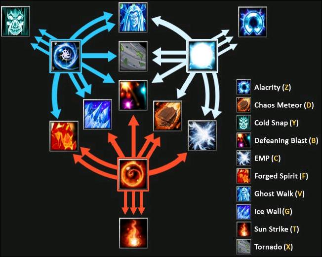

# 卡尔

## 出装
吃，头环(->挂件、拳套)
毒球，相位，蓝杖，跳刀，紫怨
暗灭，分身，冰甲

## 技能加点
冰Q（回血），雷W（速），火E（攻），换技能R

ER天火 QEQEQQR双火人、冰墙 WR双火人、短推进陨石、冰墙、波 EEEWR最大伤害陨石、冰墙 WWWWWQQQ
加一点火（提攻击好补兵），加四点冰（用火人冰墙），而后加一点雷，先满火，再满雷，最后满冰

前期技能侧重于火人、天火、冰墙，中期在于冰墙、陨石、波的限制爆发以及火人的辅助输出和吹风的战场打断。
1主火提升攻击，以及技能的伤害。
2四冰为的是早早双火人辅助FARM撑线打野推线。
3二级大招10级再学是为了尽快提升双火人的成型时间，而且前期R的CD较长，没有必要存两套技能。
4四冰后满雷的意图是增强机动性以及提升吹风的先手能力以及迅雷的拆塔能力。

另有冰雷卡，主冰，加强生存，
吹风+雷暴
推波+陨石+阳炎

QQQ 急速冷却：攻击他都会晕并加伤
WWW 电磁脉冲：聚能爆魔并伤
EEE 阳炎冲击：蓄能片伤（全图施法）

QQW 幽灵漫步：隐身，减己速和周围敌速（冰多则减敌速加多，雷多则减己速减少）
WWE 灵动迅捷：加一个友方移速（根据雷）

QQE 寒冰之墙：冰加持续时间，火加伤害
EEQ 熔炉精灵：小火人，火加其射程、生命、攻击，冰加其魔量、持续时间、护甲（双4后能召两个）

EEW 混沌陨石：雷加推进距离，火加伤害
WWQ 强袭飓风：将敌吹起，雷加推进距离，冰加滞空时间

QWE 超震声波：向后推敌，火加伤害，冰加推动时间，雷加控制时间

## 打法
先招火人，然后切换技能存储，留陨石和冰墙 技能球换成QWE，瞄准战场放陨石，跳如中心释放冰墙，然后DB推波，保证限制AOE一体。 然后看情况是切隐身逃跑 还是吹风打断。当然如果有吹风你就更吊了，直接把自己吹起，再跳走。
追杀就用吹风天火持续输出，围殴就风急冷，拆塔就迅速切换迅雷。
