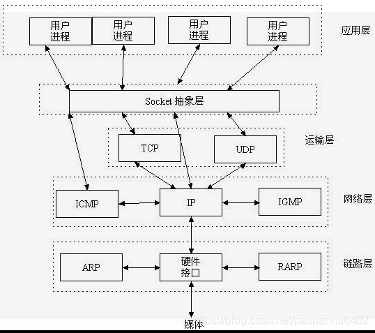

# 网络

在本地可以通过进程PID来唯一标识一个进程，网络层的“ip地址”可以唯一标识网络中的主机，而传输层的“协议+端口”可以唯一标识主机中的应用程序（进程）

## Socket

起源于Unix，而Unix/Linux基本哲学之一就是“一切皆文件”，都可以用“open –> write/read –> close”模式来操作。

Socket是应用层与TCP/IP协议族通信的中间软件抽象层，它是一组接口


服务端：端口绑定-端口监听-阻塞等待连接请求

```c
int socket(int domain, int type, int protocol);
```
对应于文件打开，用于创建一个socket描述符（后续一系列操作都依赖该参数，用于唯一标识一个socket），它存在于协议族（address family，AF_XXX）空间中，但没有一个具体的地址。如果想要给它赋值一个地址，就必须调用bind()函数，否则就当调用connect()、listen()时系统会自动随机分配一个端口
+ domain：即协议域，又称为协议族（family）  
常用的协议族有，AF_INET（ipv4）、AF_INET6（ipv6）、AF_LOCAL（或称AF_UNIX，Unix域socket）、AF_ROUTE等等。协议族决定了socket的地址类型，在通信中必须采用对应的地址，如AF_INET决定了要用ipv4地址（32位的）与端口号（16位的）的组合、AF_UNIX决定了要用一个绝对路径名作为地址。
+ type：指定socket类型  
常用的socket类型有，SOCK_STREAM、SOCK_DGRAM、SOCK_RAW、SOCK_PACKET、SOCK_SEQPACKET等等
+ protocol：指定协议。
常用的协议有，IPPROTO_TCP、IPPTOTO_UDP、IPPROTO_SCTP、IPPROTO_TIPC等  
*注意：并不是上面的type和protocol可以随意组合的，如SOCK_STREAM不可以跟IPPROTO_UDP组合。当protocol为0时，会自动选择type类型对应的默认协议。*

```c
int bind(int sockfd, const struct sockaddr *addr, socklen_t addrlen);
```
把一个地址族中的特定地址赋给socket（server侧需要指定一个连接端口，而客户端由connect时随机分配）
+ sockfd：即socket描述字，即socket()函数返回值
+ addr：指向要绑定给sockfd的协议地址。这个地址结构根据地址创建socket时的地址协议族的不同而不同
+ addrlen：对应的是地址的长度

> 主机字节序（HBO，Host Byte Order），即大端和小端模式，指整数在内存中保存的顺序，与CPU设计有关
> 1. Little-Endian就是低位字节排放在内存的低地址端，高位字节排放在内存的高地址端
> 1. Big-Endian就是高位字节排放在内存的低地址端，低位字节排放在内存的高地址端。
>
> 网络字节序（Network Byte Order）：为避免兼容性问题，网络上使用统一的网络字节顺序。4个字节的32 bit值以下面的次序传输：首先是0～7bit，其次8～15bit，然后16～23bit，最后是24~31bit。这种传输次序称作大端字节序。  
> 所以： 在将一个地址绑定到socket的时候，请先将主机字节序转换成为网络字节序，而不要假定主机字节序跟网络字节序一样使用的是Big-Endian  
> htonl()--"Host to Network Long(32位)"  
> ntohl()--"Network to Host Long"  
> htons()--"Host to Network Short(16位)"  
> ntohs()--"Network to Host Short"

```c
int listen(int sockfd, int backlog);
```
+ sockfd：socket描述字，socket()函数创建的socket默认是一个主动类型的，listen函数将socket变为被动类型的，等待客户的连接请求
+ backlog：socket可以排队的最大连接个数

```c
int connect(int sockfd, const struct sockaddr *addr, socklen_t addrlen);
int accept(int sockfd, struct sockaddr *addr, socklen_t *addrlen);
```
如果accpet成功，那么其返回值是由内核自动生成的一个全新的描述字，代表与client建立成功的TCP连接
> 监听socket描述字，一个服务器通常通常仅仅只创建一个，它在该服务器的生命周期内一直存在
> 已连接socket描述字，仅存在于一个client的服务周期中，服务结束，该socket就被关闭

IO 函数
```c
ssize_t read(int fd, void *buf, size_t count);
ssize_t write(int fd, const void *buf, size_t count);

ssize_t send(int sockfd, const void *buf, size_t len, int flags);
ssize_t recv(int sockfd, void *buf, size_t len, int flags);

ssize_t sendto(int sockfd, const void *buf, size_t len, int flags,
                const struct sockaddr *dest_addr, socklen_t addrlen);
ssize_t recvfrom(int sockfd, void *buf, size_t len, int flags,
                struct sockaddr *src_addr, socklen_t *addrlen);

ssize_t sendmsg(int sockfd, const struct msghdr *msg, int flags);
ssize_t recvmsg(int sockfd, struct msghdr *msg, int flags);
```
推荐使用recvmsg()/sendmsg()函数  
读成功时，read返回实际所读的字节数，如果返回的值是0表示已经读到文件的结束了，小于0表示出现了错误。  
写成功时，write返回写的字节数，失败时返回值小于0，并设置errno变量。如果错误为EINTR说明错误是由中断引起的，如果是ECONNREST、EPIPE表示网络连接出了问题

```c
int close(int fd);
```
close操作只是使相应socket描述字的引用计数-1，只有当引用计数为0的时候，才会触发TCP客户端向服务器发送终止连接请求

## TCP协议中的三次握手和四次挥手


### 三次握手建立连接
1. client 执行connect 函数时，发送SYN=i 的连接请求
2. 此时server 处于accept 的等待状态，返回连接允许SYN=j ACK=i+1（答复和状态同步一起发送，所以比关闭时少一次握手）
3. client 收到后，向server回复ACK j+1，然后connect 函数返回  
4. server 收到该ACK 后，accept 返回

### 四次握手断开连接
1. client 执行close 函数时，向server发送FIN i（表示client没有更多数据发送了，但server依然可以继续发送数据）
2. server此时需要被动关闭，完成IO后（添加文件结束符）返回ACK i+1（用于确认已收到结束请求，但自己尚未准备好结束）
3. 而后再执行主动关闭，发送FIN j（此时表明server已准备好结束，不会在向client发送数据）
4. client收到后返回ACK j+1（server 收到后就会断开连接进入CLOSED状态，client 进入TIME-WAIT 状态，期间若最后一个ACK丢失则重发，经过2MSL(最大报文段生存时间)之后变为CLOSED 状态）

### 常见问题
#### ISN 序列号
序列号可以标记发送和接受的字节编号，可以明确发送出去的数据哪些是被对方接收到的，哪些需要超时重发；接收方可以根据已接收的数据去重；可以确保数据包按需接收。
1. 发送方的字节数据编号的原点，让对方生成一个合法的接收窗口
2. 动态随机生成，增加安全性，为了避免被第三方猜测到，从而被第三方伪造的RST报文Reset（需要序列号正好位于对方的合法接受窗口内，所以随机生成增加了难度）
3. 使得每个tcp session的字节序列号没有重叠，如果出现tcp五元组冲突这种极小概率情况的发生，一个session的数据也不会被误认为是另一个session的

#### 是否可以不等三次握手提前发送数据
如果使用缓存，缓存这些提前发送的数据，那么当攻击者伪造大量握手报文并携带1K+ 字节的数据，就会耗尽缓存资源，从而拒绝服务，这就是SYN FLOOD攻击

而第三次握手时是可以携带数据的，因为client 已经在第二次握手时经过server 确认过了，所以第三次握手时，client可以携带数据。  
此时server在接收到ACK 切换为ESTABLISHED后立即开始处理数据

#### 是否可以两次握手建立连接
若使用两次握手，则当server收到SYN 请求后立即进入ESTABLISHED，这样建立的连接可能是一个旧的连接，因为并没有经过client 的确认，此时如果server 发送数据，则client 并不能进行有效的处理，浪费了资源。而如果使用三次握手，则server端会等到第三次握手才会最终确认是否建立连接，若client返回RST（序列号过期或超时），则终止此次连接；若client返回ACK，则成功建立连接。  
举例说明：client 发送SYN 99 给server 建立连接，由于网络阻塞，server未及时收到，client 重发了SYN 100，此时server 才收到SYN 99 并建立连接，这就是一个旧的连接，因为SYN 99 已经超时废弃了，client 就会发送RST 终止这个连接

#### 为什么建立连接使用三次握手，断开连接使用四次握手
这是建立连接可以将SYN 合并到ACK 报文上，从而减少了一次握手；而断开连接时，另一方还有未发送完的数据需要进一步发送，所以无法将FIN 合并到ACK上，所以必须使用四次握手。

#### TCP 的可靠性
在任何一端，接收到消息之后，在回复中附带上ACK（包含有序列号，可以完成多条消息的统一答复和保序的能力），这样就告知对方，消息已收到，你可以释放缓存不必重发了  
例如：Acknowledge Number == 10001，那意味着序列号10000及之前的字节已经成功接收。

## netstat 命令
可用于列出系统上所有的网络套接字连接情况，包括 tcp, udp 以及 unix 套接字，另外它还能列出处于监听状态（即等待接入请求）的套接字

### 选项
**-a或–all** 显示所有的有效连接信息。包括已建立的连接（ESTABLISHED），也包括监听连接请求（LISTENING）断开连接（CLOSE_WAIT）或处于联机等待状态的（TIME_WAIT）等的那些连接
-A<网络类型>或–<网络类型> 列出该网络类型连线中的相关地址`  
-c或–continuous 持续列出网络状态  
-C或–cache 显示路由器配置的快取信息  
**-e或–extend** 显示网络相关信息（包括传送的数据报的总字节数、错误数、删除数、数据报的数量和广播的数量）  
-F或–fib 显示FIB  
-g或–groups 显示该主机订阅的所有多播网络群组的组员名单  
-i或–interfaces 显示Interface table  
**-l或–listening** 显示Listen(监听)状态的Socket  
-M或–masquerade 显示伪装的网络连线  
**-n或–numeric** 显示所有已建立的有效连接，直接使用IP地址，而不使用别名  
-N或–netlink或–symbolic 显示网络硬件外围设备的符号连接名称  
-o或–timers 显示计时器  
**-p或–programs** 显示正在使用Socket的进程id和程序名称  
-r或–route 显示Routing Table（除了显示有效路由外，还显示当前有效的连接）  
-s或–statistice 能按各个协议分别显示其统计数据  
**-t或–tcp** 显示TCP传输协议的连线状况  
**-u或–udp** 显示UDP传输协议的连线状况  
-w或–raw 显示RAW传输协议的连线状况  
-x或–unix 此参数的效果和指定”-A unix”参数相同  
–ip或–inet 此参数的效果和指定”-A inet”参数相同
-v或–verbose 显示指令执行过程  
-V或–version 显示版本信息  

### 连接状态
LISTEN：服务器正在监听连接请求  
SYN_RECV：一个连接请求已经到达，等待确认  
SYN_SENT：应用已经开始，打开一个连接  
ESTABLISHED：已建立连接，正在进行通信  
FIN_WAIT1：应用说它已经完成  
FIN_WAIT2：另一边已同意释放  
ITMED_WAIT：等待所有分组死掉  
CLOSING：两边同时尝试关闭  
CLOSED：无连接是活动的或正在进行  
CLOSE_WAIT：断开连接
TIME_WAIT：另一边已初始化一个释放，等待超时结束  
LAST_ACK：等待所有分组死掉

## hostname
显示主机名字

### 选项
–d 显示机器所属域名
–f 显示完整的主机名和域名
–i 显示当前机器的ip地址

## ping
将数据包发向用户指定地址。当包被接收，目标机器发送返回数据包

主要有两个作用：
1. 用来确认网络连接是畅通的
2. 用来查看连接的速度

## ifconfig && iwconfig
显示当前网络设备配置，后者主要查看无线网卡Wi-Fi 网络信息

## nslookup
可以显示指定IP的主机名，也可以找到给定域名的所有ip地址

## traceroute
可用来查看数据包在提交到远程系统或者网站时候所经过的路由器的IP地址、跳数和响应时间。

## telnet
连接目标主机的指定端口

## ethtool
查看和更改网卡的许多设置（不包括Wi-Fi网卡）

### 选项
-i 启动一个适配器的指定行为
-p 显示网络统计信息
-s 设置适配器的连接速度，单位是Mbps

