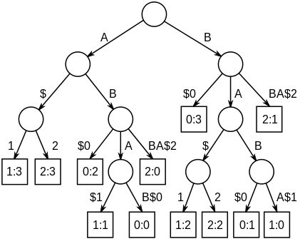

# 算法问题

## 最长公共子序列
longest common subsequence (LCS)
在一组序列中找到它们的最长公共子序列
和最长公共子串问题的不同点在于，序列不要求它们在原序列中是连续的

## 最长公共子串
### 问题描述
在一组字符串中找到它们的最长的公共子串
### 算法
#### 后缀树
generalized suffix tree（GST，广义后缀树）
给每个字符串加上`$i`的两个后缀字符（`$`也可以选用其他非字符表的字符），其中i 是字符串编号
那么从树的每一条从根到叶子结点的路径就是这些字符串的一个公共后缀，而该树的所有分支就包含了这些字符串的所有N 个后缀（设这些字符串总共有N 个字符，那么总共就有N 个后缀）
如下图所示就是三个字符串'ABAB', 'BABA', 'ABBA'，被标记为'ABAB$0', 'BABA$1', 'ABBA$2'，进而构造的GST：

而寻找最长公共子串就是在GST中找到一个深度最大的内部结点，可以包含所有字符串的后缀标记，那么从根节点到该节点的路径就是最长公共子串

##### 复杂度分析
如果字符表的大小是常量，那么构造GST的时间复杂度是O(N)
那么在k 个字符串中找最长公共子串的时间复杂度是O(k*N)

#### 动态规划
确定递推公式如下图：

即公共子串可以从n递推到n-1的规则和条件

如果把这些字符串组成一个多维矩阵上，公共子串就是这个矩阵中的一条平行与对角线的斜线段
而后用填表法即可

##### 复杂度分析
填充一个多维矩阵的表，时间复杂度是O(n1*n2*...*nk)
空间复杂度也是O(n1*n2*...*nk)，不过可以只保存k-1维，而且可以只保存非0值（稀疏矩阵）
