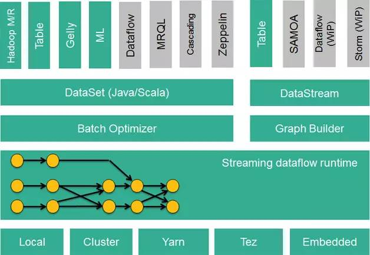

流式的数据流执行引擎，其针对数据流的分布式计算提供了数据分布、数据通信以及容错机制等功能。基于流执行引擎，Flink提供了诸多更高抽象层的API以便用户编写分布式任务：
+ DataSet API， 对静态数据进行批处理操作，将静态数据抽象成分布式的数据集，用户可以方便地使用Flink提供的各种操作符对分布式数据集进行处理，支持Java、Scala和Python。
+ DataStream API，对数据流进行流处理操作，将流式的数据抽象成分布式的数据流，用户可以方便地对分布式数据流进行各种操作，支持Java和Scala。
+ Table API，对结构化数据进行查询操作，将结构化数据抽象成关系表，并通过类SQL的DSL对关系表进行各种查询操作，支持Java和Scala。

此外，Flink还针对特定的应用领域提供了领域库，例如：
+ Flink ML，Flink的机器学习库，提供了机器学习Pipelines API并实现了多种机器学习算法。
+ Gelly，Flink的图计算库，提供了图计算的相关API及多种图计算算法实现。

Flink的技术栈如图

默认情况下会将多个连续的算子合并为一个任务（task）以减少开销
disableChaining() 的主要作用是禁止当前算子与其他算子进行链式合并，强制让该算子独立运行，而不是与前后的算子合并在同一个任务中
用于：
- 当某个算子消耗较多资源（例如内存或 CPU）时，通过 disableChaining() 强制其独立执行，避免影响其他算子的性能。
- 通过禁用链式合并，可以防止该算子成为瓶颈，影响整个链条的性能。
- 在开发和调试阶段，为了更好地观察单个算子的行为和执行性能，可以通过 disableChaining() 进行更细致的分析。
- 对某些关键算子需要进行更精确的监控和性能分析时，可以使用该方法使其单独执行，方便收集更准确的性能数据。

## 分区算子
数据会在多个算子的SubTask之间相互传递，算子之间的并行度可能是不同的，这样就产生了数据分区问题，其核心问题在于上游的某个SubTask的数据该发送到下游的哪一个SubTask中。
- forward：数据会按照指定的下游算子进行分发（默认的一对一的数据直推）
- keyBy：数据按照指定的key进行分区
- rebalance：数据使用轮询的方式均匀分配到下游算子（会跨节点进行网络传输，也就是会发送到其他TM的slot里）
  - backlogBasedRebalance：当上下游数据量不均衡时，会根据backlog 看压力去调节分配
- rescale：数据使用轮询的方式均匀分配到下游算子（只会在本TM的slot 中进行分发）
- shuffle：数据会随机分配到下游某一个算子
- broadcast：数据会发给所有下游算子
- global: 所有数据都会发到下游的第一个slot中，即强行让下游任务并行度变成了1
- partitionCustom：自定义分区策略