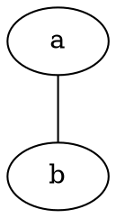
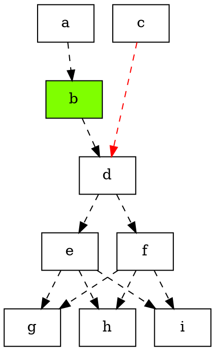

# graphviz
<http://www.graphviz.org>
<http://graphviz.org/doc/info/>
<https://graphviz.gitlab.io/_pages/doc/info/>

## 布局器
dot 默认布局方式，主要用于有向图
neato 基于spring-model(又称force-based)算法，用于无向图
twopi 径向布局，主要用于放射图
circo 圆环布局
fdp 用于无向图
sfdp 用于无向图，渲染大图

### 绘制图
```
dot -Tpng first.dot -o first.png
```

## 无向图

noabc 名字可省

## 有向图

指定节点和边的样式（默认为椭圆、实线）
节点不必声明，除非需要单独定义其样式
行末分号非必须

### 节点的排序逻辑
默认以有向边的顺序，按照rankdir 进行排序
如上图，从上到下，a、b、d 每一级占一层
c 比 d 高一级，本应和 b 同一层，但有了rank=same，就把 a、c 拉到同一层
如果给 b -> d 边加上[constraint=false] 属性，则取消该边的定级能力，则b、d 将属于同一层

### 子图
子图的名称只有以cluster开头，才显示边框
```
subgraph cluster_cd{
	label="c and d";
	bgcolor="mintcream";
	c;
	d;
}
```
subgraph 可以省去
label 是子图的标题

### 属性

#### 图属性(G)
label：图标题
fontname
fontsize
rankdir：节点排列方向默认TB（top-bottom），可以指定为LR（left-right）、RL、BT
rotate
size："8.5, 11"
bgcolor
nodesep：节点间距

#### 节点属性(N)
label：若有该属性，则显示该属性；否则显示节点名
fontname
fontsize
color：边框颜色，fillcolor：填充色
width
height
fixedsize：true/false
shape：ellipse（椭圆，默认）、plaintext（无边框）、polygon（多边形，可以用sides 指定边数，peripheries指定外框个数，skew 指定倾斜度，orientation 旋转角度，distortion 扭曲角度）、circle（圈）、doublecircle（双圈）、record（记录）、Mrecord（圆角记录）
style：filled（填充色）、rounded（圆角）

#### 边属性(E)
label：边上的文案（另有headlabel/taillabel，文案位置不同）
fontname
fontsize
color
style：solid 实线、dashed 虚线、invis 透明
color
weight：权重，越大越被视为主线
arrowhead：none（无箭头）、empty（空心箭头）、默认实心箭头
splines：边的形式

#### 属性详解
##### label
###### 分段格式（record / Mrecord）
```
A [label="{<head>st_table_entry |
		hash|key|record1\lrecord2\n|
		<next>next}"];
A:next -> A:head;
```
用`{}`划分一个可以嵌套的子区块
用`|` 进行分段
`<>` 指定分段的锚点
`\n`/`\l`/`\r` 进行换行（并使该行进行居中、左、右对齐）
上述特殊字符和空格都需要转义才能正常显示

###### HTML 格式（plaintext）
```
table [label=<
	<table border="0" cellborder="1" cellspacing="0" align="left">
	<tr>
	<td>st_table</td>
	</tr>
	<tr>
	<td>num_bins=5</td>
	</tr>
	<tr>
	<td>num_entries=3</td>
	</tr>
	<tr>
	<td port="bins">bins</td>
	</tr>
	</table>
>]
```

##### fontname
黑体：SimHei
宋体：SimSun
新宋体：NSimSun
仿宋：FangSong
楷体：KaiTi
新细明体：PMingLiU
细明体：MingLiU
标楷体：DFKai-SB
微软正黑体：Microsoft JhengHei
微软雅黑体：Microsoft YaHei
