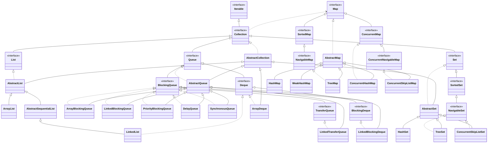

# Java
[Online Executor](https://www.jdoodle.com/online-java-compiler/)
第8页

## 一. 纯粹面向对象的设计

1. 一切皆对象  
**基础**，使得人可以从问题域中抽象出更易理解的实体，而非纠缠于细节的操作流，从而建立了问题域到解空间的更为直接的映射关系
2. 程序是对象之间通信的过程  
**方法论**，如何使用对象进行编程，使得面向对象变为可行的
3. 对象由更为简单的对象构成  
**抽象层次**，面向对象可以使用现有抽象（对象）来构建新的抽象，从而解决问题，这是面向对象更有效降低问题复杂度的根据
4. 对象皆有其所属类型，同类对象有相同接口和相近的特性，但会根据自身状态的不同具有不同的行为  
对象如何组织，更进一步产生**继承**构建对象体系，和**多态**拉近自然语言语义和程序语言语义的差距。（接口表现了对象所能提供的服务，而特性是一类对象用于区别于其他对象的特征，这两点都是对外的表现，而在内部则可以具有着不同的实现，外部无法获知也不必关心，这就是**封装**，封装很好地控制了隔离了影响，即保证了在接口不变的情况下，实现可以任意改写而不会影响其他系统）

## 二. 数据类型

### 1. 基本类型
括号中表示存储大小——字节数
这些基本类型无法像类、对象一样调用成员函数，因为它就是一个值（作为参数传递时也是值传递。注意：引用传递的虽然是对象本身，但其引用指向的变化不会影响到调用方）。不过，每种基本类型都具有与之对应的包装器（wrapper）类型（Boolean、Character、Byte、Short、Integer、Long、Float、Double、Void）。只需在需要时，装箱使用即可（赋值时自动装箱拆箱）。

#### 1.1 整数
byte(1)、short(2)、int(4)、long(8)
均表示有符号数，Java不存在无符号数

##### 数值常量表示
前缀：0b：二进制数；0：八进制数；0x十六进制数
后缀： L：long型立即数；f：float型立即数；d：double型立即数

#### 1.2 浮点数
float(4)、double(8)
浮点数则按照IEEE754标准

#### 1.3 布尔
boolean
没有规定大小，是因为通常，即单独出现时，它是4个字节，而如果使用的是布尔数组的话，则将优化为只占用1个字节
但注意和C、C++不同的是，它不再跟整数有关联，即整数无法作为布尔值，它只有true和false两个取值

#### 1.4 字符
char(2)
字符采用的是Unicode编码。前128个字符编码与ASCII编码兼容，char类型变量的存储范围’\u0000’到’\uffff’，不过可以把一个给定范围内的整形数（0到216-1即65535）赋给字符。

#### 1.5 void

#### 1.6 数值类型延伸
BigInteger和BigDecimal是两个高精度计算的类（非基本类型）。BigInteger支持任意精度的整数，BigDecimal支持任意精度的定点数（可以用来进行精确的货币计算）。

### 2. 对象
在Java中，一切皆对象（基本类型除外），但你能控制对象的手段却只有对象的引用。
形如String s的定义方法，其实只是创建了一个字符串类型的引用，而并没有相应实体（对象），只有当`String s = "abcd";`初始化（自动装箱特性），或用new出一个对象来，才能对s进行有效使用。

#### 数据存储
对象的引用存储在栈上，由程序告知编译器其生命周期，并静态维护（创建销毁读取效率高）；而对象实体则存储在堆上，由垃圾收集器进行生命周期的控制，实现动态维护（灵活但效率较低）。
对于基本类型（作为局部变量）时，均存储在栈上，因为它们都很小，如果保存到堆上，创建对象、对象存取和销毁对象的开销都太大（如果是类的成员变量，则随对象的存储位置决定）。
对于常量。对于基本类型的数值常量，如果没必要占用内存，可以直接嵌入到字节码流中；否则，会保存在栈上，且同一个值只保存一份。对于基本类型的命名常量（用final修饰）和字符串常量，会保存到常量池中，并且，同一个值也只保存一个对象（其实，命名常量同一值保存一个对象还是同一名保存一个对象尚不清晰）（对于字符串"abcd"和字符串"ab"+"cd"在常量池中保存的都是"abcd"，这是在编译期就计算好的，其他诸如字符串+数值/布尔等结果也是字符串（即数字/布尔自动转化为字符串），就也在编译期确定，但如果连接的字符串中有变量或函数的返回值，在编译期就无法确定，不过如果是final String的符号常量，还是可以编译期确定）

因此，Java的内存分配为
栈：基本数据类型的变量，对象的引用
堆：new出来的对象实例
静态区：存放静态变量（static声明）
常量池：存放命名常量和字符串常量（在编译期确定，写入.class文件，在运行期被JVM加载后，还可以扩充）
其中栈和常量池都具有数据共享，而堆对象不可以

#### 初始化
和其他语言不同，这些存储在栈空间上的基本类型数据（局部变量）和引用在参与运算前必须初始化，否则无法通过编译，即Java不会对这种变量提供默认的缺省值，这里的初始化不一定是定义时给值，可以延迟到使用前初始化即可，在内层的代码块中的赋值不会认定为有效初始化。
而堆数据，例如成员变量，如果没有初始化，Java会提供默认值，其中boolean默认为false，其他默认为0，引用默认为null

#### 隐式类型转换
```
byte->short->int->long->float->double
char->int->long->float->double
```
boolean不参与任何隐式转换
基本类型和包装类型转换
类体系的向上转换（从派生类到基类方向）

##### 自动装箱和拆箱（从J2SE 5的新特性）
其实自动装箱就是基本类型在需要时，隐式地向相应的包装器类型转型的过程（相当于调用了Type.valueOf(值)静态方法，Type为包装器类型），而拆箱则反之（相当于调用了对象的.xxxValue()方法）。
当包装类型和常量进行运算时，将自动拆箱参与运算，注意：++也是先拆箱。但千万不要把一个没有实例化的包装类引用（即null）自动拆箱给基本类型，否则将会有NullPointerException异常

对于Boolean、Byte自动装箱后，无需新分配空间，直接用引用指向对应类型的一个内部类（如Integer的IntegerCache，该内部类中有一个Integer[]数组，名为cache，保存了预置的256个Integer对象：从-128到127）cache数组中对应位置的对象即可
对于Character、Short、Integer、Long自动装箱后，如果其值在Byte的表示范围内则同上法；否则，将在堆上重新为该值创建对象，引用指向堆对象
对于Float、Double自动装箱后，都会重新分配空间，引用指向该对象。

#### Objects 工具类
equals: 可以不用考虑null
deepEquals: 调用Arrays.deepEquals0
hashCode
hash: 调用Arrays.hashCode
toString: 支持nullDefault
compare
isNull
nonNull

### 3. 枚举
#### 本质
enum类同class（证据是编译源文件后也会有一个.class文件），也是创建一种类型，差别在于其所有实例都是在类内定义好的，所以可以理解成都是常量，而且更多的工作编译器会自动完成，如toString()方法、name()方法、ordinal()方法、values()静态方法、valueOf(name)静态方法。此外，其特别之处还在于可以用于switch语句（case中不必使用枚举名引用）。
枚举内部也可以定义成员（变量和方法），当有构造器定义时，声明的常量需要调用这些构造器进行初始化。

枚举有着严格的实例化控制（不能克隆、反序列化、反射构造，有限实例化，只有枚举内定义的枚举常量），可以直接使用`==` 进行等值比较，equals 方法的实现也是直接使用`==`（并且是final 方法）。而且最好使用`==`，因为可以有更严格的编译期检查，也不会因为枚举变量为null 而抛空指针异常。

#### 方法
values() 返回一个数组，可以使用ordinal() 返回的值作为索引获取到对应的枚举。

### 4. 字符串
#### 4.1 构造String
定义空串：
```
String str = ''
String str = String()
```
还可以使用char[]作为构造器参数构造String，该字符数组包含了所有串的字符（不需要尾标志）（反之，将一个String转换为char[]，可以调用toCharArray()方法）

#### 格式化
String.format(format, args...)方法
%d是包括了int,long,byte等等类型了
%02d: 长度为2，不足使用0 填充的整数
%.2f: 小数点后保留2位的浮点数

#### 4.2 String的常用方法
首先，说明的是，使用引号的字符串常量本身就是一个String对象，可以直接调用这些String类的方法："".fn()，而无需用new String("...").fn()这种复杂形式
虽然重载了+和+=操作符，但并未重载==操作符，因此，对两个字符串进行比较的时候一定要用equals或equalsIgnoreCase方法（不区分大小写），同理，进行比较时也要用compareTo方法或compareToIgnoreCase方法

查找
+ indexOf(s): 找到就返回该字符串中第一次出现的s的索引，如果没有，返回-1
+ lastIndexOf(s, fromIndex): 从fromIndex开始反向查找，找到就返回该字符串中最后一次出现的s的索引，如果没有，返回-1（fromIndex 超出长度，就查找整串，若为负，则直接返回-1）
+ contains(s): 如果包含，返回true，否则返回false
+ match(regex): 正则匹配，如果匹配成功，返回true，否则返回false

处理
+ split(regex, limit=0): 字符串的正则分割，如果regex是空串""，则等价于toCharArray()，只不过得到的是String[]，其每个String都是单字符，而toCharArray()得到的是char[]（中文也算单个字符），第二个参数是分割后String[]数组的最大容量，即如果第二个参数为n，则只会对前n-1次匹配进行分割。当然第二个参数可省，效果是对串进行尽可能多次的匹配。如果第二个参数小于等于0，其效果和省略第二个参数相同
  + 这里的正则需要注意反斜杠转义，比如"\\s+", "\\."
+ replace: 支持单字符、字符串的替换
+ replaceFirst/replaceAll 支持正则替换
+ intern(): 调用该方法后，Java将到常量池中找和该字符串有相同内容的存储对象，如果找到，就返回在常量池中找到的对象引用；如果找不到，就在常量池中添加该字符串对象，返回其引用。

#### 4.3 StringBuffer类和StringBuilder类
String是一种不变（immutable）类（对于封装器类型也是），如果字符串频繁变化，将导致产生很多废弃对象，此时，应当采用StringBuffer类。不过该类型是一个线程安全的类，因此从效率上会打折扣，如果你的程序是单线程的，或者你决定自己负责线程安全，就应该使用更有效的StringBuilder类。它们可以预指定缓冲长度，用append和insert方法加载字符串，当在需要时，用toString方法转换为String

#### StringTokenizer
构造：StringTokenizer(String str, String delim=" \t\n\r\f", boolean returnDelims=false)
delim 也可以指定其他分隔符，默认切割后的子串不包括分隔符，也不包括空串（即连续的分隔符会被忽略）
```java
StringTokenizer st = new StringTokenizer("hello world");
while (st.hasMoreTokens()) {
	System.out.println(st.nextToken());
}
```

#### 4.4 关于中文字符串
关于这一点和汉字机内码有关，一般大陆常用的是GBK，港台采用的是Big5（更多参见http://zh.wikipedia.org/wiki/GBK）
在默认情况下（Java的字符是Unicode字符，即UTF-16编码），故一个汉字和一个字符是等价的，在使用length计算长度的时候，都被计为一个长度。

### 5. 数组
#### 5.1 Java数组的特殊性
Java的数组也是一种对象，它封装了一些方法，并能进行一些运行时检查（访问越界异常）。因此，声明数组Type[] var;的时候，实际上是声明一个数组类型的引用。当使用大括号初始化法或new Type[n];的时候，才分配了一组引用空间（并被初始化为默认值——类0值）。注意，这里是引用空间，只能赋以基本类型和引用，并非保存了对象实体。因此，如果需要持有对象，还需要将对象的引用赋到相应位置。
不过，和C语言数组相同的部分是其同样是规模固定的一组相同类型的数据集合。
由于Java的数组是一种对象，所以其有一个属性length可以随时获知该数组的大小，但由于数组的每个单元未必都保存了对象，所以除非判断数组元素是否是null，否则无法知道数组实际存储的量。

#### 5.2 数组的初始化
在使用new时，如果没有用大括号指定成员，则所有成员都被初始化为类0值；否则则按大括号内容初始化，并且此时new Type[]中括号中不允许有内容。对于多维数组的大括号初始化，每一部分是一个低一维的数组作为成员（因此也就允许了锯齿形的多维数组）。

#### 5.3 Array与Arrays
从上面可知Array是一个反射类，动态创建、修改和访问数组
而Arrays如同其他容器+s的类，是一个工具类。提供各种处理数组的静态方法，如：
toString()：数组转换为String（相当于对将数组每个成员转换为String）
equal()：相同容量，且元素对应相等才算相等
sort()：排序
binarySearch()：二分查找元素（基于数组是有序的）
asList(T...)：返回 List<T>，由于容器不支持基本类型，所以如果入参是基本类型，会被自动装箱。（该容器可以调用toArray()方法变回数组，不过该返回的List<T>是一个数组实现的，无法改变其大小，因此该返回对象不支持进一步的add和remove，不过，可以通过该对象作为其他可变容器构造器的输入）基本类型可以使用guava类库的Ints/Doubles 的对应方法。

### 6. 容器
容器全是基于泛型实现的，对于Java而言一个泛型xxx<T>就是一个xxx<Object>类型，基本类型不继承Object，而基本类型的数组是继承Object 的。
根接口Collection
继承树

和数组显示不同，容器对象的toString方法已经类似Arrays.toString进行了重写，因此，容器类对象直接输出显示，将显示其内容。

#### List
##### ArrayList
大小可变（容量自动扩展），可包含null
非线程安全
支持随机访问，但在中间增删元素开销大

##### LinkedList
双向链表，可包含null
非线程安全

#### Set
最多有一个null
##### HashSet
根据hashCode 决定存储位置（hash 分桶）
非线程安全
HashSet 去重是通过hashCode()方法 确定分桶，再使用equals方法和桶内元素比较以明确是否包含。
*注意：重写hashCode() 的话一定不要依赖对象的可变属性，因为容器不会因为成员的hashCode 的变化而自动rehash；因此一旦对象属性发生变化，hashCode 就随之变化，那么在容器中的对象也会因为hashCode 的变化而找不到*

##### LinkedHashSet
hashCode值来决定元素的存储位置，同时使用链表维护元素的次序，可以按添加顺序访问，稍微增加了插入的成本

##### TreeSet
可以确保集合元素处于排序状态（默认自然升序排序，也可以给构造函数传一个Comparator 进行排序）
通过TreeMap 实现，不允许重复，不允许null值
非线程安全

#### Map
+ putAll(map)：将另一个map 合并到本map 里
+ remove(key): 单条删除。批量删除可以：map.keySet().removeAll()
+ compute(key, (k, v) -> newValu): 在map 中找key和对应的value，传入第二个参数的函数中（没有这个key，则传入的value为null），若函数返回为null，则从map中删除对应的k-v，否则将返回的新值替换原来的value。该函数的返回值始终为新值（也就是第二个参数的函数的返回值）
+ computeIfAbsent(key, k -> value): 若key 存在，则直接返回，不调用函数；否则，则将key 传入第二个参数的函数中，返回的结果作为新的value，放入map 中。该函数的返回值始终为新值
+ computeIfPresent(key, (k, v) -> newValu): 若key 不存在，则直接返回null；否则跟compute方法一样

##### HashMap
哈希表实现，使用链表解决冲突，默认的负载因子是0.75，当超载后自动扩充2 倍后，进行rehash
非线程安全

##### LinkedHashMap

##### TreeMap
默认按其键的自然顺序进行升序排序，也可以给构造函数传一个Comparator 进行排序
通过红黑树算法实现，可以实现null键和值
非线程安全

#### 同步容器
同步容器可以简单地理解为通过synchronized来实现同步的容器，如果有多个线程调用同步容器的方法，它们将会串行执行
Collections.synchronizedList()
Collections.synchronizedSet()
Collections.synchronizedMap()
Collections.synchronizedSortedSet()
Collections.synchronizedSortedMap()

#### 并发容器
提供了更细粒度的加锁策略
+ CopyOnWriteArrayList：写入效率低，读取效率高
+ BlockingQueue：阻塞式的线程安全队列的接口，有多种实现，队列为空时获取元素等待，队列为满时存入元素等待
	ArrayBlockingQueue：基于数组的有界阻塞队列
	LinkedBlockingQueue：基于链表的有界阻塞队列
	PriorityBlockingQueue：支持优先级的无界阻塞队列。默认情况下，元素采取自然升序排列
	DelayQueue：延时获取元素的无界阻塞队列。根据比较机制，实现自定义处理顺序的队列。
	SynchronousQueue：容量=0 的等待队列
+ ConcurrentLinkedQueue：非阻塞方式实现的线程安全队列，性能很好
+ CopyOnWriteArraySet
+ ConcurrentSkipListSet：TreeSet的线程安全版本

##### ConcurrentMap
###### ConcurrentHashmap
主要使用Segment来实现减小锁粒度，把HashMap分割成若干个Segment，在put的时候需要锁住Segment，get时候不加锁，使用volatile来保证可见性，当要统计全局时（比如size），首先会尝试多次计算modcount来确定，这几次尝试中，是否有其他线程进行了修改操作，如果没有，则直接返回size。如果有，则需要依次锁住所有的Segment来计算。ConcurrentHashmap大量的利用了volatile，final，CAS等lock-free技术来减少锁竞争对于性能的影响

但ConcurrentHashMap并不能完全替代HashTable。两者的迭代器的一致性不同的，HashTable的迭代器是强一致性的（Hashtable则会锁定整个map），而ConcurrentHashMap是弱一致的

###### ConcurrentSkipListMap
TreeMap的线程安全版本，性能比ConcurrentHashmap 稍低

#### BitSet
内部使用long[] 存储，并按序增长
##### 构造
BitSet()
BitSet(int size)
BitSet.valueOf(bytes)：bytes 不能是null，否则抛NPE

##### 方法
length()：取决于最后一个setBit 的长度
size()：已分配的字节数，因为内部使用long[]，所以是Long.SIZE 整数倍
cardinality()：setBit 的个数
isEmpty()：cardinality() == 0
get: 如果超出length()，则返回false
set
clear
flip：取反
intersects(BitSet)
and/andNot
or/xor
nextClearBit(fromIndex)：不用考虑长度，返回从fromIndex（含）开始的clearBit 的位置
nextSetBit(fromIndex)：返回从fromIndex（含）开始的clearBit 的位置，若fromIndex >= length() 则返回-1
previousClearBit(fromIndex)
previousSetBit(fromIndex)

## 三. 运算

`==`运算符，如果两个操作数中有对象，则比较的是对象的引用，即是否指向同一对象实体，除非该类型重载了Object类型的equals函数

逻辑运算符的操作数必须是boolean类型，如上所说，不再能使用整形数表示布尔值了
逻辑运算不同于位逻辑在于，它可以短路求值

## 四. 控制

### 1. foreach结构
### 2. 带标签的break和continue
对没有goto的弥补：可以在循环前加上标签（和goto的标签类似），而后在循环内，就可以使用break和continue后面跟标签名了。
break 标签——表示退出标签所指定的循环（可以大退很多层循环）
continue 标签——表示退出到标签位置继续循环（执行该循环的递增，而跳过内部的递增）

## 五. 执行相关

### 1. 命令行下执行定义包中的类
首先，要将一个类作为执行入口，需要找到这个类的“.class”文件，且该类必须有一个可访问的main静态方法。查找类的方法如下：
Java会按在系统定义的CLASSPATH环境变量，找到包所在的根目录（如果没有定义CLASSPATH环境变量，则默认是到“.”即当前目录下去找类文件。如果定义了就不会有这个默认了，必须显示写上“.”，也可以按自己习惯的工作目录进行添加，用分号分隔）
如果CLASSPATH环境变量只有“.”或者说未定义CLASSPATH环境变量，则需在命令行中定位到包的根目录，如MyClass类定义在了fproject包中，则找到fproject文件夹的所在位置；如果已经为CLASSPATH环境变量设好了自己工作目录，则在任意目录都可进行下步了
输入命令：java fproject.MyClass（其中“.”还可以换做“/”）

### 2. Java的命令行参数
Java的命令行参数args并不包括java命令和类名，即从真正的参数起，下标记0
在myEclipse下的设置：在项目或包或文件的Properties对话框中的Run/Debug Setting中的右侧，找到对应文件，打开后，就可以编辑其Argument选项卡了

## 六. 方法函数
支持重载
不支持参数默认值

### 1. 可变参数
可变参数必须是函数最后一个参数，其本质是一个数组
```
void println(Object...args) {
	Arrays.stream(args).forEach(System.out::println);
}
```

### 2. 函数查找
对于一次函数调用按下面流程查找匹配的实现，如果找到一个就使用，如果找到多个
1. 优先匹配固定个数的函数
	1. 根据形参的类型，先去找有没有能够精确匹配的函数
	2. 对形参进行隐式类型转换后能够匹配的函数，如果可以找到多个这种近似匹配的函数，则会优先匹配那些更接近的函数（这里“更接近”的意思是指，其他函数能精确匹配的位置，他都能精确匹配，此外，它还多出其他函数没有的精确匹配的位置，并且对于不能精确匹配的部分，类型也更为接近，即隐式转换的间隔类型最少。注意这里讲的是位置、数量和类型的综合，不是单纯看数量或更优的位置），如果无法分辨谁更接近（都有自己精确匹配而其他不能精确匹配的位置）则报告ambiguous错误
2. 再找可变参数的函数。
按重载函数中固定参数部分进行上面所说的优先匹配，而对可变参数部分，如果都是基本类型和另外的包装类型按最近匹配，如果有基本类型和其包装类型同时匹配，则直接报告ambiguous错误。特别的，对于无参调用变参函数，则如果只有基本类型，按基本类型隐式转换，从低到高进行优先匹配，如果同时包含基本类型和类，或者都是类，则报告ambiguous错误。（对于变参的隐式转换，以第一个变参参数为准，后续隐式转换为该类型）

### 函数式
#### immutable 对象
内置的Integer、Double、String 都是
特点：
1. final 类
1. 复制构造器执行深拷贝
1. 所有成员final，且不提供setter；getter 返回成员的拷贝

##### 容器
JDK 8: 
+ Collections.unmodifiableList(Arrays.asList(a, b, ...))
+ Collections.unmodifiableSet(set)
+ Collections.unmodifiableMap(map)

JDK 9:
+ List.of(a, b, ...)
+ Set.of(a, b, ...)
+ Map.of(a, b, ...)
+ Map.ofEntries(entry(key, val), ...)

JDK10:
List.copyOf(list)
Collectors.toUnmodifiableList()
Collectors.toUnmodifiableSet()
Collectors.toUnmodifiableMap

#### Stream 函数
一条Stream 流只能被结尾操作消费一次，不允许多次消费

##### 数据源
Collection 的stream 和parallelStream 方法
Arrays.stream(array, start, end)：后两个参数可省
Stream.of(T...) 和Stream.empty()
IntStream.range 和rangeClosed

##### 中间操作（intermediate operation）
+ map(mapper): 可以是类的无参方法，也可以是单参数的静态方法，有一个特殊的是Function.identity() 表示原样返回
+ flatMap(mapper): 这个mapper 的返回值是一个stream，通过拼接这些stream，来实现将二级集合拍平
+ filter(Predicate): 相当于一个where 条件，过滤掉返回false 的元素
+ distinct(): 使用 hashCode() 和 eqauls() 方法来区分不同的元素，来进行去重
+ sorted(comparator): comparator 可以缺省，则使用对象的自然顺序排序（对象需要实现Comparable 接口），如果使用unordered Stream，那么顺序会被破坏。comparator 可以是Comparator.comparing(mapper, comparatorU)，通过mapper，可以将比较对象转换为类型U，而后按U 的comparatorU 进行比较（当然也可以缺省）

##### 结尾操作（terminal operation）
###### collect 的Collectors
toArray(String[]::new)

toCollection(collectionFactory)
collectionFactory 是一个Supplier 返回一个Collection 的实例，常用于toList、toSet 方法返回的不能保证mutability, serializability, or thread-safety时，可以自己指定具体的实例类

groupingBy(classifier, downstream)
第一个参数表示如何从元素中获取到key，也就是分组的key
第二个参数，缺省时为toList()，否则使用downstream 进行收集
返回一个`Map<key, X>`

toMap(keyMapper, valueMapper, mergeFunction)
第一个参数形如item->key表示如何从元素中获取到key
第二个参数形如item->value表示如何从元素中获取到value，不允许为null，否则会抛NPE
第三个参数形如(a, b)->c可缺省，表示当key 冲突时，如何选取合并为一个value（若缺省，冲突时则抛IllegalStateException）

collectingAndThen(downstream, finisher)
先用downstream 进行收集（这个类似collect方法），在用finisher 进行一个集合转换（入参是collect 收集完成的集合）

mapping(mapper, downstream)
先用mapper 将集合中每个元素进行map，然后用downstream 将这些元素收集

partitioningBy	分组

reducing	用于内部reduce

counting	计数
summingX	求和
averagingX	求平均
minBy
maxBy
summarizingX
joining		字段串连接

###### 其他归集函数
```
reduce(U init, F<U, T> accumulator, O<U> combiner)
```
init 是个初始值，accumulator 是累加器，即initn + iter，combiner 是合并器即init1 + init2（这个参数是给parallelStream 使用的，用于结果归并，对于stream 只使用前两个参数）
对于parallelStream 由于每个线程都会复用这个init 进行accumulator 计算，所以需要生成一个线程本地的init，同时也要小心init 的重复累计（所以最佳实践是不要改变原对象，而采用创建新对象的方式，即采用immutable 的方式进行计算），然后在用各个线程的结果调用combiner 计算
例如
```
reduce(new List, (list, u) -> {
	newList = list.clone();
	newList.add(u);
	return list;
}, (u, v) -> {
	res = u.clone();
	res.addAll(v);
	return res;
})
```
*注意JSONArray 内部保存list 的引用，new JSONArray(list) 是引用的转移，而不是拷贝，所以必须使用clone()*

```
findFirst()
findAny()
```
返回一个Optional 对象，Optional 其实是个个数为[0,1] 的Stream（支持map/flatMap/filter），此外还可以：
get(): 获取对象，或者抛NoSuchElementException
isPresent(): 判断个数为0 还是1
orElse(x)：相当于getOrDefault。若不存在则返回默认值
orElseGet(Supplier)：默认值延迟获取
or(Supplier): 默认值延时获取，并且返回Optional
orElseThrow(Supplier): Supplier 返回一个异常对象，即修改抛出的异常对象
ifPresent(Consumer): 若存在则执行
ifPresentOrElse(Consumer, Runnable): 若有值则执行Consumer，否则执行Runnable
stream(): 转为一个真正的Stream

创建Optional（不是 Serializable, 不应该用作类的字段）：
Optional.empty(): 创建空对象
Optional.of(obj)：仅在明确obj != null 时使用，否则直接抛NPE
Optional.ofNullable(obj)

## 七. 访问控制
让使用者无法触及他们不应触及的部分，而不可见就减少了不必要的干扰
### 1. Java的访问特性
Java消除了允许类，方法等的向前引用的问题，在调用之后的代码中定义。但对于变量，依然只能前向索引，因为变量需要初始化，但类和方法不必。
### 2. 名空间管理
Java使用packet包解决名字管理的问题，在引入某个packet中的类时，使用import关键字，而且可以导入一个包中的所有的类，即可以使用`*` 表示一个包下的所有类。不过注意，这种导入不会产生递归导入，即如果包中含包，则子包的内容不会被自动导入。
此外，还有一种import static，可以只将类中的静态方法导入进来，这样，在当前文件中，就可以像使用自己的静态方法一样不用加类名就能直接调用。
### 3. 访问控制修饰词
除public、protected、private之外，还有默认（什么都不写），相当于包内public，包外private
而这四种访问控制具有依次的包含关系：
private最小，只在该类内部可见
包其次，在一个包内可见
protected而后，由于其隐式有包权限，相当于比包权限多了其派生类的访问权
public最大，全局可见

## 八. 类和对象
一个文件中可以定义多个类，但最多只能有一个是public ，如果有public 类，则文件需以该类命名，否则可以使用任一类来命名，一般main 函数会放在public 这个类中
### 1. 对象的生灭
对象创建的初始化顺序和清理顺序
1. 类的加载（类的静态域被访问或类的第一个实例被构造时产生）  
    a) 按CLASSPATH和包路径在寻找“.class”文件，并加载到内存（虚拟机）  
    b) 按继承层次递归加载其基类  
    c) 按序初始化各个static域和static代码段
2. 对象的初始化（使用new调用构造器时产生）  
    a) 分配内存空间，并将对象域空间清零（基本类型设默认值，引用类型设null）  
    b) 按继承层次递归到其基类，对基类进行对象初始化过程  
    c) 按序初始化各个域和代码块  
    d) 执行该类的构造器函数体
3. 除内存外的清理过程（调用自定义的dispose或类似函数时产生）  
    a) 自身的清理过程  
    b) 逆序调用组合成员的清理过程（当确保该对象唯一被自己所使用时）  
    c) 调用基类的清理过程

关于Java的清理
首先，所有与内存分配有关的清理工作都要交给垃圾回收器进行统一清理
这里涉及了两个常常提及的函数：
protected void finalize()：这个函数名是固定的，因为它是由垃圾回收器进行自动调用的，用于进行非Java代码（即JNI技术：Java直接调用本地接口，如操作系统的C/C++接口）中分配出的动态内存的清理工作。注意：由于垃圾回收的过程无法控制，而且也并不一定总能执行，所以该函数的调用也是无法控制的，也不一定总能执行。因此，一般不要写该方法，但如果要写的话，其一般也是先清理自身的不可自动回收内存，再用super.finalize()调用基类该方法进行递归清理（而这需要在try-catch块内）。
protected void dispose()：这个函数名是可以自己定义的，因此其调用需要手动进行。其作用是清理对象中使用的除内存以外的资源（如：文件句柄、数据库连接、绘制窗口句柄等）。编写方法见上。
显然，dispose函数的调用相较于C++的析构函数是略显繁琐的（栈对象可以自动析构），有时也可能会忘记调用，导致当一些对象销毁后，其所占用的资源尚未被释放。而这种潜在的问题往往难以发现，因此，finalize有一种特殊的用法：即检测该类对象所占用的资源句柄是否已释放，如已释放，则执行正常的finalize过程，如果未释放，则显示某个资源未释放的信息，以引起警觉。同理，用finalize还可以检测与对象销毁有关的一些终结条件，如是否有其他对象依赖于该对象（即确保该对象销毁前，没有任何依赖关系），或者确保每个对象在销毁前必须是某种状态，若非该中状态说明潜藏了状态异常的对象等。

使用dispose函数的位置，一般当决定不再使用该对象的时候，调用该函数，但由于异常的存在，有可能使程序流程跳过该函数，因此，为了确保对象占有的非内存资源一定得到释放，需要在构造该对象后使用try块，并将该函数放入finally子句中。

### 接口
#### Serializable
标识接口，告知JVM 该类可使用ObjectInputStream / ObjectOutputStream 进行序列化和反序列化
需要类具有无参构造函数
该接口会随继承关系传递
建议类定义一个用于序列化版本控制的常量，用于在反序列化时进行对比，若一致说明无变更，可以完成反序列化
```
private static final long serialVersionUID = 1L;
```
若未声明该值，则JVM 会根据类的各个方面自动生成一个值，这样就会由于编译器实现不同导致serialVersionUID不一致，从而反序列化就可能抛出InvalidClassException

使用transient关键字修饰的的变量，在序列化对象的过程中，该属性不会被序列化。

##### Externalizable
继承Serializable
类可以控制序列化的细节

#### Cloneable
Object 有一个protected 方法clone() 想要重写该方法必须实现Cloneable 接口，否则将抛CloneNotSupportedException 异常
clone() 方法可以重写为public 的，只需针对类中的可变类型进行自定义复制即可

## 九. 继承相关
### 成员覆盖
派生类可以定义一个和基类同名同类型的成员，如果基类该成员可见，该成员将覆盖基类该成员，除非使用super索引。
对于基类的静态成员，派生类会和基类共享该静态成员。也就是说，该字段在基类和它的所有派生类们共享同一份。同样，派生类也可以定义一个同名同类型静态成员覆盖基类该成员，此时，就是两个变量，而非一个。

### 方法重载
继承后的方法，既支持重写，也支持重载
重载是指具有不同的方法标识（方法名和参数表），而重写则是具有相同的方法标识和返回类型。如果想要明确使用重写，而非重载（就像C++一样）可以使用@Override注解，这样，重载就会报错。

## 十. 运行时的类型信息
调用.getClass()方法，该方法继承自Object类，且Java的内置类大都已重写，该方法返回的是对象的真实类型信息（并非引用的类型），这种数据结构是一种名为Class的类。
这个类涉及到Java的反射机制，主要是指程序可以访问、检测和修改本身状态行为的一种能力。简单地说，就是程序可以在运行时动态加载、获取、修改在编译期未知类型的对象，即能够“看透并操纵”对象的能力。之所以叫“反射”，是因为它往往是对象自己通过检查自身的状态，进行修改和调整，因此也被称为Introspection（内省、内观）。通过反射，实现了系统实现的开放性。除了开放性，反射系统还有个必要条件就是有因连接（Causally-connected），即反射系统自描述的改变能够立即放映到实际的状态和行为上。
通过反射，可以构建更灵活的代码。使程序可以动态接入到JVM中类的内部信息，而不是源码中选定的类协作的代码。但如果使用不当，反射的成本就会很高（一方面是性能问题，不要再核心代码使用反射；一方面是反射绕过了源码技术，导致难以理解程序逻辑，也就难以维护）。因此，只有在真正需要反射的灵活性的地方，在考虑要不要使用反射。
在Java中和反射相关的类还有Constructor类、Method类、Field类、Modifier类、Array类（都在java.lang.reflect包中）。用以获取类的类型、构造器、方法、域、访问修饰词等信息，数组的动态创建和修改。
获取Class对象的方法：
    1. obj.getClass()或obj.getSuperclass()
    2. Class.forName(类名的字符串)——该方法需要函数声明throws ClassNotFoundException（位于函数头后，表示该函数可能抛出一个该类型的异常），或者将该句包含在异常处理的try-catch块中。并且类名的字符串必须是带有包路径的。否则将找不到，抛出该异常。
    3. 类型名.class
    4. 包装器类型名.TYPE
这个对象可以直接输出显示（隐式调用toString方法），但如果执行显示类名可以调用getSimpleName()方法，类型为String。
当然该对象还有很多获取类其它信息的方法。举个例子，通常我们使用的是多态来动态绑定方法，即参数使用基类或接口类型。而通过反射，我们就可以将String作为参数来确定类型，并通过newInstance方法生成实例（当然，也可以通过检查其构造器方法，来使用Method类的invoke方法生成实例），在通过检查该类所具有的方法，使用Method类的invoke方法来调用（如果是private方法，可以先调用该Method对象的setAccessible(true)来取消对本方法的安全检查），也可以通过检查该类所具有的域，使用Field类的set方法去设置。从而获得了更大的灵活性，而不只是建立在继承层次上的动态性。

## 十一. I/O

标准输入System.in，标准输出System.out，错误输出System.err

在Java5 之前
```java
BufferedReader br=new BufferedReader(new InputStreamReader(System.in));
String str=null;
while((str=br.readLine())!=null)
```

在Java5 及以后使用Scanner
```java
Scanner sc=new Scanner(System.in);	// 可以是任意InputStream 对象，例如File
while (sc.hasNext()) {				// 当遇到EOF 结束
	String s = sc.next();			// 使用分隔符（默认是空白符）获取下一个用户输入，分隔符不会被读入
}
sc.close();
```
此外Scanner还有其他方法：
useDelimiter 可以修改分隔符
hasNextLine - nextLine，使用换行符作为分隔符，换行符不会被读入
各种类型的hasNext - next，若类型不匹配则抛异常·

### 1. File
面向流的老IO 接口（阻塞式）
java.io.File，可以表示一个文件或目录
可以进行文件或目录的创建、删除、属性修改
```java
File file=new File(path)
```

该类下有几个环境相关的常量：
separatorChar：路径分隔符
pathSeparatorChar：PATH 环境变量分隔符

#### 方法
##### 判断
exists()
isDirectory()

##### 操作
createNewFile()
mkdir()
支持递归创建目录（mkdirs），但不支持删除非空目录

##### 查询/获取
getParentFile()

### 2. Stream
+ 字节流
InputStream、OutputStream
+ 字符流
Reader、Writer

#### FileInputStream / FileOutputStream
```
InputStream fis = new FileInputStream(file)
fis.close()
OutputStream fos = new FileOutputStream(file)	// 第二个参数是bAppend
fos.close()
```
可以读写byte[]

#### ObjectInputStream / ObjectOutputStream
```
ObjectInputStream ois = new ObjectInputStream(fis)
ois.close()
ObjectOutputStream oos = new ObjectOutputStream(fos)
oos.close()
```
可用于对象的序列化和反序列化

#### Reader / Writer
```
FileReader fr = new FileReader(file)
while ((num = fr.read()) != -1)
fr.close()

InputStreamReader isr = new InputStreamReader(fis, "UTF-8")

BufferedReader br = new BufferedReader(reader)
br.lines()	// 返回一个stream
while ((line = br.readLine()) != null)	// 老式遍历行
br.close()


// 文件Writer
FileWriter fw = new FileWriter(filePath, bAppend=false)
fw.close()

// 流Writer
OutputStreamWriter osw = new OutputStreamWriter(fos, "UTF-8")

// 块缓存装饰，第二个可省参数定义块大小，默认8k
BufferedWriter bw = new BufferedWriter(writer)
bw.close()

// 行缓存装饰，支持自动刷新，入参可以是OutputStream、Writer、File、fileName（在BufferedWriter 之上包装）
PrintWriter pw = new PrintWriter(xxx)
```
有write 和append 方法都可以写字符串，append 对于null 会写一个"null"，并返回this，其他就调用write（null 会抛异常）

### try-with-resources
无需在finally 中进行close()，资源必须使用Closeable 或AutoCloseable接口
```
try (FileReader reader = new FileReader(file)) {	// 可以使用分号写多个资源
	// xxx
} catch (Exception e) {
	e.printStackTrace();
}
```

### 3. RandomAccessFile
length(): 文件长度，字节数
支持seek(pos) 和skipBytes(n) 可以随机定位在文件的位置（可以直接定位到length() 的位置去追加）
getFilePointer() 返回当前的文件指针位置（初始为0）
直接集成了read 和 write 系列方法，需要close() 关闭
getChannel() 返回FileChannel 对象

new RandomAccessFile(filePath, mode)
mode 支持
r：只读，使用write 系列方法都会导致IOException异常
rw：读写，若文件不存在，则创建之
rwd：读写，每次更新都同步到存储设备（仅限内容更新）
rws：读写，每次更新都同步到存储设备（包括内容和元数据更新）

### 4. Path / Paths / Files
面向缓冲的新的IO 接口（非阻塞式）
```
Path path = Paths.get("a", "b", "c");
```
可以和File 相互转换


#### Buffers
+ ByteBuffer
+ CharBuffer
+ ShortBuffer
+ IntBuffer
+ LongBuffer
+ FloatBuffer
+ DoubleBuffer

三个概念
capacity：容量
position：当前的读写位置，初始为0，最大为capacity-1
limit：最大的读写位置，写模式=capacity，读模式=flip 时的position

ByteBuffer buf = CharBuffer.allocate(n)：创建n 个char 空间的buffer
capacity()：容量
limit()
position(pos)：设定position 位置
mark()：标记position 当前位置
reset()：恢复position 到mark 的位置
remaining()：返回limit - position
hasRemaining()：返回position < limit，是否还有未读内容
flip()：写模式切换到读模式
clear()：清空缓存（忽略未读数据，进入写模式）
compact()：清除已读数据（保留未读数据，进入写模式）
rewind()：重头读（把position设为0，mark设为-1，不改变limit的值）
put(xxx)：直接写入buf
get()：直接从buf 中读取

#### Channels
读写双向的，完成后需要close()
+ FileChannel：文件读写
通过InputStream，OutputStream 或RandomAccessFile 获取
transferFrom() 可以从其他channel 中获取数据
transferTo() 可以把数据传给其他channel
+ DatagramChannel：UDP数据读写
通过DatagramChannel.open() 方法获取
bind(new InetSocketAddress("127.0.0.1", 3333))：绑定端口
receive(buf)：接受消息到buf
send(buf, new InetSocketAddress("127.0.0.1", 3333))：发送消息到指定端口，返回发送的字节数
+ SocketChannel：TCP数据读写（client侧）
通过SocketChannel.open() 方法获取
connect(new InetSocketAddress("127.0.0.1", 3333))：连接服务器
+ ServerSocketChannel：TCP数据读写（server侧）
通过ServerSocketChannel.open() 方法获取
socket().bind(new InetSocketAddress("127.0.0.1", 3333))：绑定端口
accept()：监听连接，返回一个SocketChannel

从buf读取写入Channel
int bytesWritten = channel.write(buf);
从Channel读取写入buf
int bytesRead = channel.read(buf);

##### Scatter / Gather
+ Scatter: 从一个Channel读取的信息分散到N个缓冲区中(Buufer).
channel.read(bufArr)：一个buf 写满，就写下一个
+ Gather: 将N个Buffer里面内容按照顺序发送到一个Channel.
channel.write(bufArr)：按序放入channel 中

#### Selectors
单线程可以监视多个通道中的数据
注册到Selector 上的Channel 必须是非阻塞的，即需要继承SelectableChannel，所有FileChannel 不行
```
Selector selector = Selector.open();
socketChannel.configureBlocking(false);         // 设置非阻塞模式
SelectionKey key = socketChannel.register(selector, SelectionKey.OP_CONNECT | SelectionKey.OP_READ);
selector.select()		// 阻塞，直到有一个channel 在你注册的事件上就绪了，返回值是本次有几个通道已就绪
		select(long timeout)
		selectNow()		// 非阻塞
selector.selectedKeys() // 获取已就绪的key 的集合
selector.close()		// 使得任何一个在select() 中阻塞的线程都被wakeup()
```
register 第二个参数标识监听的事件，还可以指定第三参数attachment（当然也可以后续在进行附加）
返回的SelectionKey 标识注册关系，可以获取注册时的信息。还有一个方法readyOps() 可以获取已经准备就绪的事件集合（当然，也可以用is 系列方法分别查询），可以使用cancel() 方法取消，被取消的isValid() == false

selector.keys() 返回该选择器上注册的所有SelectionKey
selector.wakeup() 使正在阻塞的select() 方法或下一次执行的select() 方法立即返回


### 5. HTTP
常用的包是org.apache.httpcomponents
#### request
HttpGet()
HttpGet(String url)
HttpGet(URI)

HttpPost()
HttpPost(String url)
HttpPost(URI)

方法：
setHeader(name, val)
abort()

##### 请求参数
对于GET：
可以使用setParams(HetpParams params)方法来添加请求参数
对于POST：
也可以使用setParams(HetpParams params)方法来添加请求参数
还可以使用setEntity
```
List params = paramMap.entrySet().parallelStream().map((entry) ->
			new BasicNameValuePair(entry.getKey(), entry.getValue())
	).collect(Collectors.toList());
request.setEntity(new UrlEncodedFormEntity(params, "UTF-8"));

StringEntity stringEntity = new StringEntity(json, "UTF-8");// 解决中文乱码问题
stringEntity.setContentEncoding("UTF-8");
stringEntity.setContentType("application/json");
request.setEntity(stringEntity);
```

##### 请求配置
```
RequestConfig requestConfig = RequestConfig.custom()
	.setConnectionRequestTimeout(1000)	// 从连接池获取连接的超时时间，单位毫秒
	.setConnectTimeout(1000)			// 建立连接时间（三次握手），必须设置，以防连接被阻塞
	.setSocketTimeout(2000)				// 响应过程中数据包之间间隔的最大时间
	.build();
request.setConfig(requestConfig);
```
此外构造httpClient 时，也可以使用setDefaultRequestConfig() 进行设置

#### response
HttpResponse
CloseableHttpResponse
方法：
getStatusLine() 可以获取StatusLine 对象，该对象可以通过getStatusCode 获取http 结果状态码，可以通过getReasonPhrase() 获取结果错误信息
getAllHeaders() 和getHeaders(name) 可以获取响应头
getEntity() 获取结果实体，可以通过getContent() 方法获取结果流（而后使用IOUtils.toString() 获取String），也可以通过EntityUtils.toString(entity) 将其转化为一个String
close()

#### httpClient
HttpClient
CloseableHttpClient
```
HttpClient httpClient = HttpClients.custom()
	.setXXX()
	.build();
```
其中setXXX 包括上面提到的setDefaultRequestConfig，还有setConnectionManager(), setKeepAliveStrategy(), setSSLSocketFactory()（对于https）

方法：
execute(request)
execute(request, httpContext)
execute(request, responseHandler)
close()
其中
前两个返回的是HttpResponse
第三个中的responseHandler 可以是一个lambda 表达式，用于对HttpResponse 进行后置处理，将其转换为一个指定的类型返回

##### ConnectionManager
PoolingHttpClientConnectionManager
方法：
setMaxTotal
setDefaultMaxPerRoute

##### KeepAliveStrategy
可以使用实现ConnectionKeepAliveStrategy 接口的匿名类，也可以使用lambda 表达式
例如：
```
(HttpResponse response, HttpContext context) -> {
	BasicHeaderElementIterator it = new BasicHeaderElementIterator(response.headerIterator("Keep-Alive"));

	String param;
	String value;
	do {
		if (!it.hasNext()) {
			return 120000L;
		}

		HeaderElement he = it.nextElement();
		param = he.getName();
		value = he.getValue();
	} while(value == null || !param.equalsIgnoreCase("timeout"));

	try {
		return Long.parseLong(value) * 1000L;
	} catch (NumberFormatException var8) {
		return 120000L;
	}
}
```

## 十二. 并发
Supplier:get：生成函数（无参有返）
Function:apply：通道函数（有参有返）
Predicate:test：检测函数（有参有返bool）
Consumer:accept：终端函数（有参无返）
Callable:call：无参有返（和Supplier 的差别在于Supplier 关注的是生成数据，应该是幂等的；而Callable 关注是完成任务，返回一个简单的任务结果，是非幂等的）
Runnable:run：无参无返

### 1. 多线程
+ 继承Thread类重写run方法
+ 实现Runnable接口重写run方法，然后用该实现的实例初始化Thread
然后都可以调用Thread 类的start() 方法去启动线程

Thread.currentThread() 可以获取当前的线程
Thread.sleep(millisec)：线程休眠millisec 毫秒，如果发现中断标识会抛出InterruptedException 异常


#### 方法
isInterrupted()：当前线程的中断标识是否被置位
interrupt()：线程的中断状态将会被设置为true


### 2. 线程同步
#### synchronized
获得锁才能进入对应的代码块，同一时间只能有一个线程访问代码块
1. 标记实例方法：锁挂在实例对象上，同一个实例的多个实例方法共享同一把锁
2. 标记静态方法：锁挂在类对象上
3. 标记代码块：锁挂在synchronized(obj) 的obj 对象上

### 3. ThreadPoolExecutor
继承链 -> AbstractExecutorService -> ExecutorService -> Executor
```
ThreadPoolExecutor(int corePoolSize, int maximumPoolSize, long keepAliveTime, TimeUnit unit, BlockingQueue<Runnable> workQueue,
	ThreadFactory threadFactory, RejectedExecutionHandler handler);
```
最后两个是可选参数
+ corePoolSize：核心池的大小，创建了线程池后，默认情况下，线程池中并没有任何线程，而是等待有任务到来才创建线程去执行任务，除非调用了prestartAllCoreThreads()或者prestartCoreThread()方法
+ maximumPoolSize：线程池最大线程数
+ keepAliveTime：线程保活时长，即线程没有任务执行时最多保持多久时间会终止。默认情况下，只有当线程池中的线程数大于corePoolSize时，keepAliveTime才会起作用，即其仅作用于非核心线程，除非调用了调用了allowCoreThreadTimeOut(boolean)方法，才会作用于线程池中的所有线程
+ unit：keepAliveTime 的时间单位
+ workQueue：等待队列
	- ArrayBlockingQueue：先进先出，创建时必须指定大小（有界队列）
	- LinkedBlockingQueue：先进先出，如果创建时没有指定此队列大小，则默认为Integer.MAX_VALUE（无界队列）
	- SynchronousQueue：没有容量的队列，它不会保存提交的任务
	- PriorityBlockingQueue
+ threadFactory：用于创建线程
+ handler：拒绝策略，都有
	- AbortPolicy：丢弃并抛RejectedExecutionException异常
	- DiscardPolicy：直接丢弃
	- DiscardOldestPolicy：丢弃队头
	- CallerRunsPolicy：直接在调用线程中执行该任务

每来一个任务，若没有空闲线程
如果当前线程池中的线程数目小于corePoolSize，则会创建一个线程去执行这个任务；
如果当前线程池中的线程数目>=corePoolSize，则会尝试将其添加到任务缓存队列当中，若添加成功，则该任务会等待空闲线程将其取出去执行；若添加失败（一般来说是任务缓存队列已满），则会尝试创建新的线程去执行这个任务；
如果当前线程池中的线程数目达到maximumPoolSize，则会采取任务拒绝策略进行处理；
largestPoolSize：仅用于记录线程池中曾经有过的最大线程数目

#### 构造线程池
不提倡直接new，而是使用Executors类的几个静态函数进行创建：
newCachedThreadPool()：corePoolSize=0，maximumPoolSize=Integer.MAX_VALUE，keepAliveTime=60s，SynchronousQueue
newSingleThreadExecutor()：corePoolSize=maximumPoolSize=1，LinkedBlockingQueue，返回的是DelegatedExecutorService（继承AbstractExecutorService），目的是为了屏蔽ThreadPoolExecutor 这个类动态修改线程池配置的一些方法
newFixedThreadPool(size)：corePoolSize=maximumPoolSize=size，LinkedBlockingQueue
newScheduledThreadPool(coreSize)：corePoolSize=coreSize，maximumPoolSize=Integer.MAX_VALUE，keepAliveTime=0，workQueue=DelayedWorkQueue返回ScheduledThreadPoolExecutor 实例，可定期或者延时执行任务

#### 线程池的重要方法
execute(Runnable)：异步执行一个无参无返回的函数
submit(Callable<T>)：异步执行，该方法返回一个Future<T>，用以获取执行结果
invokeAll(Collection<? extends Callable<T>>, timeout, unit)：同步执行一组函数，直到全部执行完成或超时，后两个参数可省。若超时，future.isCancelled()==true，若再调用future.get() 会抛出CancellationException 异常
invokeAny(Collection<? extends Callable<T>>, timeout, unit)：同步执行一组函数，直到其中有一个完成或超时，返回这个函数的返回值

shutdown()/shutdownNow()：关闭线程池，区别是前者允许正常执行的任务继续执行完，后者正在执行的任务也会被停止（通过调用Thread.interrupt()方法来实现，如果线程中没有sleep 、wait、Condition、定时锁等应用, 该方法是无法中断当前的线程的）所以该方法不一定就能立即退出，也要等到所有正在执行的任务执行完毕
awaitTermination(timeout, unit)：执行完shutdown 方法，执行该方法会等待所有线程都执行结束（返回true）或者超时（返回false）

##### Future 的方法
get(timeout, unit): 阻塞并获取结果，参数表示阻塞等待的超时时间，可省
cancel(b): 参数是一个boolean，若为true，则可以打断执行中的任务；若为false，则只能阻止尚未启动的任务（排队中）
isCancelled(): 判断任务是否超时或取消

#### ScheduledThreadPoolExecutor


### CompletableFuture
带有Async就是异步执行的意思，就是不在当前线程，另起线程执行（可以接受一个Executor 执行）

#### 创建任务
CompletableFuture 静态方法：
supplyAsync(Supplier, executor=ForkJoinPool.commonPool())
runAsync(Runnable, executor=ForkJoinPool.commonPool())
completedFuture(value)：直接返回结果，无计算

#### 获取任务结果
isDone()	判断是否已完成
V get();	阻塞，如果任务异常（ExecutionException, InterruptedException）需要用户手动处理
V get(long timeout,Timeout unit);	阻塞带超时
T getNow(T defaultValue);	不阻塞，若任务未完成，则返回defaultValue
T join();	阻塞，如果任务异常抛出uncheck 异常（包装成CompletionException异常 /CancellationException异常），不强制catch

#### 回调函数
每个函数都有对应的Async 方法，差别就是最后多一个executor=ForkJoinPool.commonPool() 参数
##### 过程回调
thenApply(Function)
thenRun(Runnable)
thenAccept(Consumer)

#### 终端回调
handle(BiFunction<T, ex>)	计算结果完成，或者抛出异常的时候调用，无论中间哪一步抛异常，都是立即调进该回调（因为有返回值，所以不会再调用exceptionally）该方法会新生成一个CompletableFuture
whenComplete(BiConsumer<T, ex>)	计算结果完成，或者抛出异常的时候调用，无论中间哪一步抛异常，都是立即调进该回调（和exceptionally 谁在前，谁先调用）该方法并不会生成一个新的CompletableFuture，而是透传原CompletableFuture
exceptionally(Function<Throwable, T>)	执行异常的兜底返回，无论中间哪一步抛异常，都是立即调进该回调，该方法无Async 方法

#### 任务组合
thenCombine(CompletionStage fb, BiFunction bf)	当前future 和fb 都执行完成后，将结果调用bf 后返回，bf 的第一个参数是当前future 的返回，第二个参数是fb 的返回
thenAcceptBoth(CompletionStage, BiConsumer)
runAfterBoth(CompletionStage, Runnable)

applyToEither(CompletionStage fb, Function f)	当前future 和fb 哪个先执行完，将结果调用f 后返回
acceptEither(CompletionStage fb, Consumer)
runAfterEither(CompletionStage fb, Runnable)

`thenCompose(Function<T, CompletionStage>)`	效果类似thenApply

CompletableFuture静态方法：
allOf(CompletableFuture...)	当所有子CompletableFuture 都完成，才认为该组合CompletableFuture 完成
anyOf(CompletableFuture...)	当有一个子CompletableFuture 完成，就认为该组合CompletableFuture 完成

## 十三. 工具
### 随机数
初始化一个随机数发生器Random rand = new Random(sed);其中sed是一个随机种子（int），也可以省去，将以当前时间作为随机种子。
而后就可以使用该发生器，调用nextType(range)方法获得一个随机数，如nextInt(39)将得到0到38之间的任一整数，nextFloat()，nextLong()，nextDouble()等

或者直接使用Math.random()静态方法，产生[0,1)之间的double随机数

### 系统时间
System.currentTimeMillis()，以毫秒为单位，返回当前时间戳（从1970年1月1日0时起的毫米数，有可能不精确，取决于操作系统的时间精度），返回类型为long
它和new Date().getTime(); 和 Calendar.getInstance().getTimeInMillis();得到的结果是相同的。（Calendar 的方式最慢，因为要处理时区问题）

System.nanoTime()，以纳秒为单位，返回一个时间差值，其基准时间是一个任意的但固定的值，返回的就是当前到这个基准时间的纳秒差。这个基准时间是由JVM所定的，所以不同JVM上的基准时间一般不同。但同样不能保证绝对精确。返回类型为long

### UUID
```java
// Java内置的生成方式，可能会重复，概率很小（高并发可能发生）
import java.util.UUID;

UUID uuid = UUID.randomUUID();
// 或
long time = System.currentTimeMillis();
int random = (int) (Math.random() * Integer.MAX_VALUE);
UUID uuid = new UUID(time, random);
uuid.toString()

// 使用Apache Commons IO库
import org.apache.commons.io. UUIDUtils;
UUIDUtils.randomUUID().toString();
```
不同库的实现方式不同，格式有差异

其他还有
Google Guice库中的UUIDGenerator类
JDK的MessageDigest类和SecureRandom类：可以通过Hash算法和随机数生成UUID
使用Snowflake算法生成UUID，可以在多个节点上生成唯一的ID
使用Redis集群的redisson框架提供的RUID类生成UUID
利用SecureRandom类生成

## 十四. 调用其他语言
### Groovy
<http://docs.groovy-lang.org/>
全包：
```
<dependency>
    <groupId>org.codehaus.groovy</groupId>
    <artifactId>groovy-all</artifactId>
    <version>2.5.6</version>
    <type>pom</type>
</dependency>
```

#### 1. 使用GroovyShell
```
GroovyShell groovyShell = new GroovyShell();
groovyShell.evaluate(String scriptText)
groovyShell.evaluate(File file)
groovyShell.evaluate(Reader in)
```
evaluate 是直接执行groovy 脚本代码，支持多种代码输入
对于1、3 两种方法都可以指定一个fileName 用于缓存脚本（当前的实现未启用缓存），若未提供，则使用ScriptX.groovy，X 是计数序号
本质上是生成Script 而后调用run()

##### 脚本复用
```
Script script = groovyShell.parse(String scriptText)
Script script = groovyShell.parse(File file)
Script script = groovyShell.parse(Reader in)
```
groovyShell 内置了一个GroovyClassLoader，内部是通过这个loader的parseClass 方法解析出Class，而后在调用InvokerHelper.createScript 生成
由于当前实现未启用缓存，为避免每次执行重复生成Script 对象，导致频繁gc，所以最好把script 缓存起来

##### 环境变量
```
groovyShell.setProperty(String property, Object newValue)	// 设置变量为bean.property 或者bean['property']
groovyShell.setVariable(String name, Object value)

groovyShell.getProperty(String property)
groovyShell.getVariable(String name)
```

变量复用
```
Binding binding = new Binding();
binding.setProperty
binding.setVariable

GroovyShell groovyShell = new GroovyShell(binding);
```

##### 工具
InvokerHelper.invokeMethod

#### 2. 使用GroovyClassLoader
```
CompilerConfiguration config = new CompilerConfiguration();
config.setSourceEncoding("UTF-8");
// 设置该GroovyClassLoader的父ClassLoader为当前线程的加载器(默认)
groovyClassLoader = new GroovyClassLoader(Thread.currentThread().getContextClassLoader(), config);

Class<?> groovyClass = groovyClassLoader.parseClass(file);			// 这个版本启用缓存了
										.parseClass(scriptText);	// 这个方法也可以提供一个fileName 参数用于缓存（当前实现未启用缓存），若未提供，则使用script{Timestamp}{scriptText.hashCode()}.groovy
GroovyObject groovyObject = (GroovyObject) groovyClass.newInstance();
Object methodResult = groovyObject.invokeMethod("sayHello", new Object[] {});
```
GroovyClassLoader与Java中的加载器一样，同一个类名的类只能加载一次（classCache，key 是类名），如果想再次加载，必须调用GroovyClassLoader的clearCache()方法移除所有已经加载的Groovy Class
除了上面的classCache，内部还有一个sourceCache，key 是脚本的文件名

*注意*
由于Class回收的条件是：
1. 所有实例都已GC；
2. 类对象（Class）不再被引用
3. 加载该类的ClassLoader 已被GC
所以每次parseClass 都会生成一个Class 并且无法被回收，当不断循环调用导致PERM 占满，就会不断触发fullGC

#### 3. 使用GroovyScriptEngine
运行时加载脚本，并监听脚本变化，当脚本发生变化时重新加载
```
// 设置script根路径，可以设置多个，new String[] {}
GroovyScriptEngine engine = new GroovyScriptEngine(paths);
// 或者ScriptEngine scriptEngine = scriptEngineFactory.getScriptEngine();
// scriptEngine.eval(script);
// (Invocable) scriptEngine.invokeFunction(function, objects)

Object result = engine.run(file, binding);
```
内部缓存scriptCache，key 是脚本的路径
