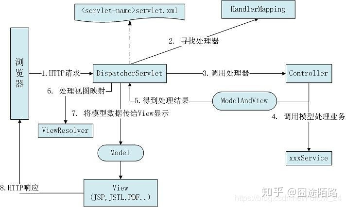

# Spring

<https://spring.io/guides>  
<http://c.biancheng.net/spring/>  
一站式的轻量级的java开发框架，核心是控制反转（IOC）、依赖注入（DI）和面向切面（AOP），对WEB层、业务层、持久层等都提供了多种配置解决方案  
IOC 和DI 保证了松耦合，不主动指定具体类型去查找和创建，而被动的获取依赖对象，而真正的实现类通过配置明确；  
AOP 分离了应用的业务逻辑与系统级服务，进行内聚性的开发

+ SpringMVC
在Spring 基础之上的一个MVC框架，属于WEB层的解决方案
原理图：
类似的竞品有
  + Struts2 功能虽然强大，但历史上漏洞较多，而且不及SpringMVC 的开发效率和性能;
  + Vert.x、jFinal
+ SpringBoot
针对SpringMVC 配置繁琐的问题，遵循默认优于配置的理念，一定程度上取消xml配置，简化了插件配置流程，集成了快速开发的spring多个插件，同时自动过滤不需要配置的多余的插件，不开发前端视图，是一套快速配置开发的脚手架，能快速开发单个微服务（独立部署、独立访问、水平扩展）；
spring-boot-starter-web模块中包含有一个内置tomcat，可以直接提供容器使用，因此都不用额外的WEB容器，直接生成jar包即可执行
+ SpringCloud
大部分的功能插件都是基于springBoot去实现的，springCloud关注于全局的微服务整合和管理，将多个springBoot单体微服务进行整合以及管理；
简化了分布式系统基础设施的开发, 如服务发现注册、配置中心（协同）、消息总线（通信）、负载均衠、断路器（熔断）、数据监控等

## bean

Spring的依赖注入的最大亮点是所有的Bean对Spring容器的存在是没有意识的，我们可以将Spring容器换成其他的容器，Spring容器中的Bean的耦合度因此也是极低的。  
但Bean 需要意识到容器的存在才能调用容器所提供的资源。Spring提供的一系列接口Spring Aware来实现具体的功能。  
Aware是一个具有标识作用的超级接口，实现该接口的bean是具有被spring 容器通知的能力的，而被通知的方式就是通过回调。

常见Aware的作用
+ BeanNameAware 获得到容器中Bean的名称
+ BeanFactoryAware 获得当前bean Factory,从而调用容器的服务
+ ApplicationContextAware 获得当前的application context从而调用容器的服务
+ MessageSourceAware 得到message source从而得到文本信息
+ ApplicationEventPublisherAware 应用时间发布器,用于发布事件
+ ResourceLoaderAware 获取资源加载器,可以获得外部资源文件
因为ApplicationContext接口集成了MessageSource接口、ApplicationEventPublisher接口和ResourceLoader接口，因此当Bean继承自ApplicationContextAware的时候就可以得到Spring容器的所有服务

### 生命周期

在spring IoC容器中，一般担当管理者角色的是BeanFactory或ApplicationContext，从它们取得的实例为Singleton（singleton属性默认是true）  
对于多线程的程序，就必须注意安全(Thread-safe)的议题，防止多个线程同时存取共享资源所引发的数据不同步问题

ApplicationContext 是BeanFactory的子接口，还提供了更加丰富的框架功能  
对于BeanFactory容器，当客户向容器请求一个尚未初始化的bean时，或初始化bean的时候需要注入另一个尚未初始化的依赖时，容器就会调用createBean进行实例化。  
对于ApplicationContext容器，当容器启动结束后，便实例化所有的bean。

如果是用BeanFactory来生成,管理Bean:  
1. postProcessBeanFactory: 若有BeanFactoryPostProcessors 与之关联，则按order指定的顺序依次调用之（容器加载配置中的bean 定义之后，实例化之前，可以通过参数获取到BeanDefinition，修改bean的元数据，例如可以把bean的scope从singleton改为prototype，也可以把property的值给修改掉）
2. postProcessBeforeInstantiation: 若有InstantiationAwareBeanPostProcessorAdapter 与之关联，则调用该方法。如果该方法返回的是non-null对象 ，这个bean的创建过程就会被短路，就不会执行postProcessAfterInitialization的方法和postProcessPropertyValues方法; 相反的如果方法返回值为null,则会继续默认的bean的实例化过程。
3. **实例化 Instantiation**：通过获取BeanDefinition对象中的信息进行实例化。实例化对象被包装在BeanWrapper对象中，BeanWrapper提供了设置对象属性的接口，从而避免了使用反射机制设置属性。
4. postProcessAfterInstantiation：若有InstantiationAwareBeanPostProcessorAdapter 与之关联，则调用该方法。如果返回true,则说明会在这个bean设置属性方法，即调用postProcessPropertyValues方法。否则会跳过对象bean属性设置过程。
5. postProcessPropertyValues：若有InstantiationAwareBeanPostProcessorAdapter 与之关联，则调用其方法。如果这个方法返回为空，也不会对目标bean设值
6. **属性赋值 Populate**：按照BeanDefinition中的配置信息使用setter进行赋值和依赖注入
7. setBeanName：若实现BeanNameAware 接口，则调用对应方法传配置的bean id
8. setBeanFactory：若实现BeanFactoryAware 接口，则调用对应方法传入工厂自身
9. (setApplicationContext): 若是用ApplicationContext来生成并管理Bean，并且bean实现ApplicationContextAware接口，则调用对应接口
10. postProcessBeforeInitialization：若有BeanPostProcessors与之关联，则调用对应方法
11. @PostConstruct: 若有方法带有该注解，则执行之
12. afterPropertiesSet: 若实现InitializingBean接口，则调用对应的方法
13. **init-method**：若在bean的配置中指定该属性，则调用属性值对应的方法（本质上仍然使用了InitializingBean接口）
14. postProcessAfterInitialization：若有BeanPostProcessors与之关联，则调用对应方法
Bean已经可以被应用系统使用
当容器关闭时
1. 销毁 Destruction：若实现DisposableBean接口，则执行他的destroy()方法
2. **destroy-method**：若在bean的配置中指定该属性，则调用属性值对应的方法

内置的BeanFactoryPostProcessor实现类：
+ PropertyPlaceholderConfigurer
+ PropertyOverrideConfigurer
+ CustomAutowireConfigurer
+ CustomScopeConfigurer
+ CustomEditorConfigurer：用来注册自定义的属性编辑器

内置的BeanPostProcessor实现类：
+ CommonAnnotationBeanPostProcessor：支持@Resource注解的注入
+ RequiredAnnotationBeanPostProcessor：支持@Required注解的注入
+ AutowiredAnnotationBeanPostProcessor：支持@Autowired注解的注入
+ PersistenceAnnotationBeanPostProcessor：支持@PersistenceUnit和@PersistenceContext注解的注入
+ ApplicationContextAwareProcessor：用来为bean注入ApplicationContext等容器对象

#### 循环依赖
##### scope=singleton
三级缓存（3个Map，key都是是BeanName)：
第一级：singletonObjects，日常实际获取Bean的地方，当bean完成初始化后放入
第二级：earlySingletonObjects，属性注入过程中，value就是被循环依赖的Bean，把这种bean 从三级移入二级
第三级：singletonFactories，Value是ObjectFactory（函数式接口getObject，可以是一个lambda表达式）
例如A->B->A 这样
+ getBean(A) 发现A 不在singletonObjects 中，则查看earlySingletonObjects，仍不在，查看singletonFactories，仍没有，则将创建A 的工厂方法放入第三级（之所以使用工厂方法而不是真实的bean，是因为暂时还不需要真实的bean，存工厂方法拥有更多创建对象的灵活性）
+ 在注入A 属性的过程中，发现依赖B，同上把B 的工厂方法放入第三级
+ 在注入B 属性的过程中，发现依赖A，在第三级发现A，此时必须要有真实的bean了，则使用工厂方法获取bean 对象（也可能是其动态代理），放入第二级，同时将工厂方法从第三级移除，这样，B 就可以依赖A 这个bean了，进而完成了B 的初始化，此时使用B 的工厂方法生成bean 对象（也可能是其动态代理），放入到第一级，同时将工厂方法从第三级移除
+ 而后A 的初始化工作也完成了，就将A 直接从第二级移入到第一级即可，getBean(A) 即可返回A 实例

##### scope=prototype
每次创建都是新对象，不需要缓存

### 依赖注入

#### bean 生产

##### 在类定义上使用注解

+ @Component: 泛组件
+ @Service: Service层
+ @Controller: Controller层
+ @Repository: 数据存储层

#### bean 使用

##### 使用注解

+ @Autowired 是自动从spring的上下文找到合适的bean来注入
+ @Resource 指定名称注入

可以用在字段、构造器、setter 上
